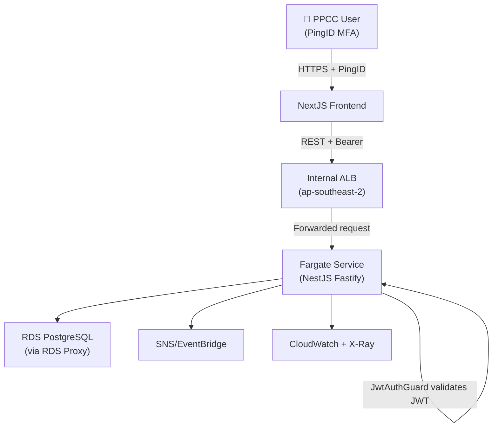
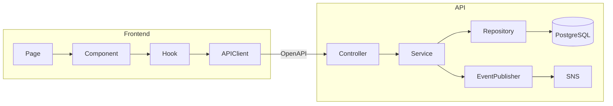
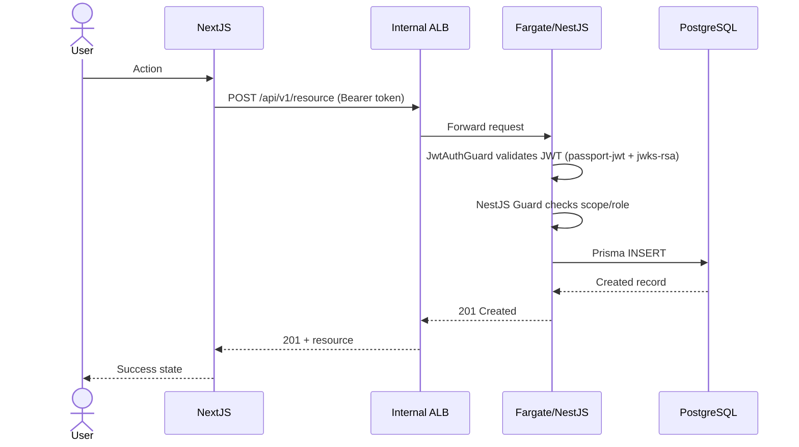

# Architecture Design

## Input

$ARGUMENTS (feature or system area to design)

## Process

### 1. Read Context

- Read `@specs/functional-specifications.md`
- Read existing architecture if any: `@.claude/docs/architecture/`
- Query CEB MCP: "PPCC architecture standards for [feature type]"
- Query CEB MCP: "PPCC AWS approved services"

### 2. Identify Constraints

Always apply:

- AWS DirectConnect (no public AWS endpoints)
- PingID via in-app NestJS `JwtAuthGuard` (internal ALB → Fargate service)
- ap-southeast-2 region only
- APRA CPS 234 compliance
- Wireframe designs (if available in `.claude/wireframes/` folder)
- NestJS on Fargate only (Fastify container behind internal ALB); CDK `ecsPatterns.ApplicationLoadBalancedFargateService`
- AWS CDK v2 for infrastructure

### 3. Architecture Document

> **Binding diagram standard:** every Mermaid diagram below MUST follow
> `@.claude/standards/mermaid-standards.md` — portable syntax (no `aws:`/iconify
> icons), emoji sparingly (≤1 per role-bearing node), the `classDef` theme
> palette, `subgraph` trust/network boundaries, and `accTitle`/`accDescr`. The
> examples in this file are illustrative; the standard governs.

#### System Context Diagram

#### Component Diagram

#### Sequence Diagram (per feature)

#### Data Flow Diagram

#### Security Boundaries

#### NFR Analysis

### 4. Architecture Decision Records

For each key decision, create an ADR using format in `@.claude/agents/architect.md`

### 5. Technology Decisions

| Concern | Choice | Rationale | Alternatives Rejected |
|---|---|---|---|

### 6. Risk Register

| Risk | Likelihood | Impact | Mitigation |
|---|---|---|---|

## Output Files

- Architecture: `.claude/docs/architecture/{feature}-architecture.md`
- ADRs: `.claude/docs/adr/ADR-{NNN}-{title}.md`
- Diagrams embedded in Mermaid within architecture doc

## Cross-References

- Diagram standard (binding): `@.claude/standards/mermaid-standards.md`
- Diagram authoring examples: `@.claude/commands/diagram-create.md`
- Standards: `@.claude/standards/`
- DB design: `/design-database`
- API design: `/design-api`
