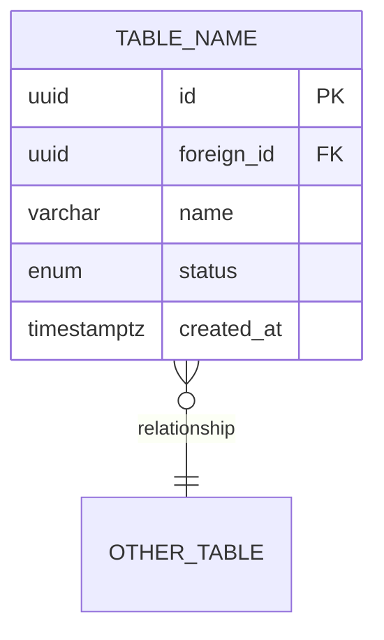
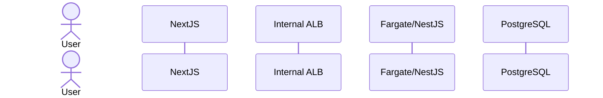
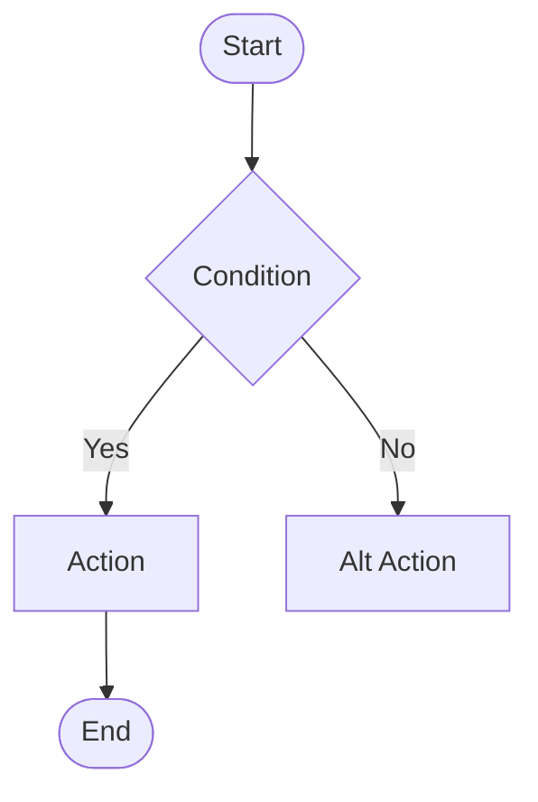
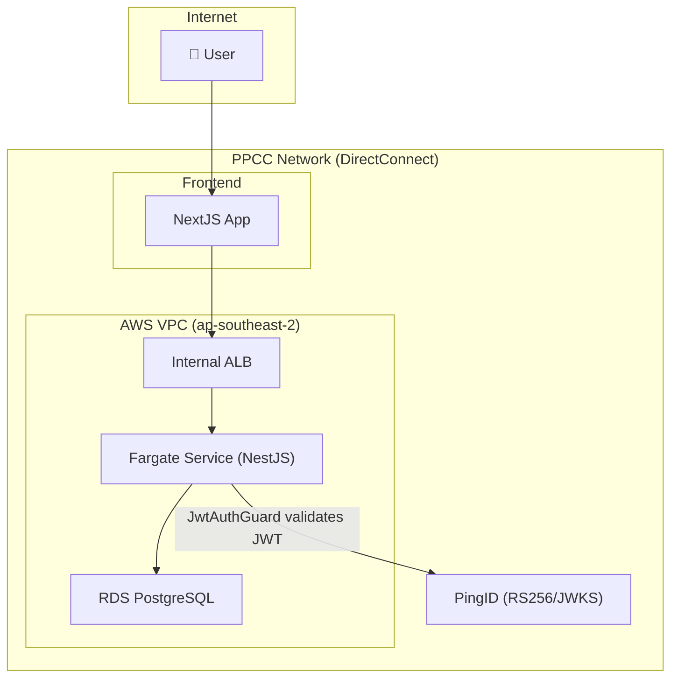

# Diagram Generation

> **Binding standard:** every diagram this command emits MUST follow
> `@.claude/standards/mermaid-standards.md` — portable syntax (no `aws:`/iconify
> icons), emoji used sparingly (≤1 per role-bearing node), the `classDef` theme
> palette, `subgraph` boundaries, and `accTitle`/`accDescr`. Load it before
> authoring. The same standard governs `/convert-image-to-mermaid` so both paths
> produce identical-looking output.

## Input

$ARGUMENTS (diagram type and subject)
Examples:

- `ER diagram for cart_items table`
- `sequence diagram for PingID authentication flow`
- `flow diagram for order processing`
- `component diagram for resource management feature`
- `architecture diagram for the full system`

## Diagram Types

### ER Diagram

```

Trigger: "ER diagram for {table/feature}"
Source: Read Prisma schema and migration files

```



### Sequence Diagram

```
Trigger: "sequence diagram for {flow}"
Source: Read controller, service, relevant config
```



### Flow Diagram

```
Trigger: "flow diagram for {process}"
```



### Architecture Diagram

```
Trigger: "architecture diagram for {system/feature}"
Always include: DirectConnect, PingID, VPC boundaries
```



## Process

1. Parse $ARGUMENTS to determine diagram type and subject
2. Read relevant source files (entities, controllers, configs)
3. Generate Mermaid diagram
4. Output in a markdown code block with diagram type label
5. Save to `.claude/docs/diagrams/{subject}-{type}.md`

## Output

Always output:

1. The Mermaid diagram code block
2. A brief description of what the diagram shows
3. Key relationships or flows highlighted

## Cross-References

- Binding standard: `@.claude/standards/mermaid-standards.md`
- Image → Mermaid: `@.claude/commands/convert-image-to-mermaid.md`
- Architecture: `/design-architecture`
- Database: `/design-database`
- API: `/design-api`
