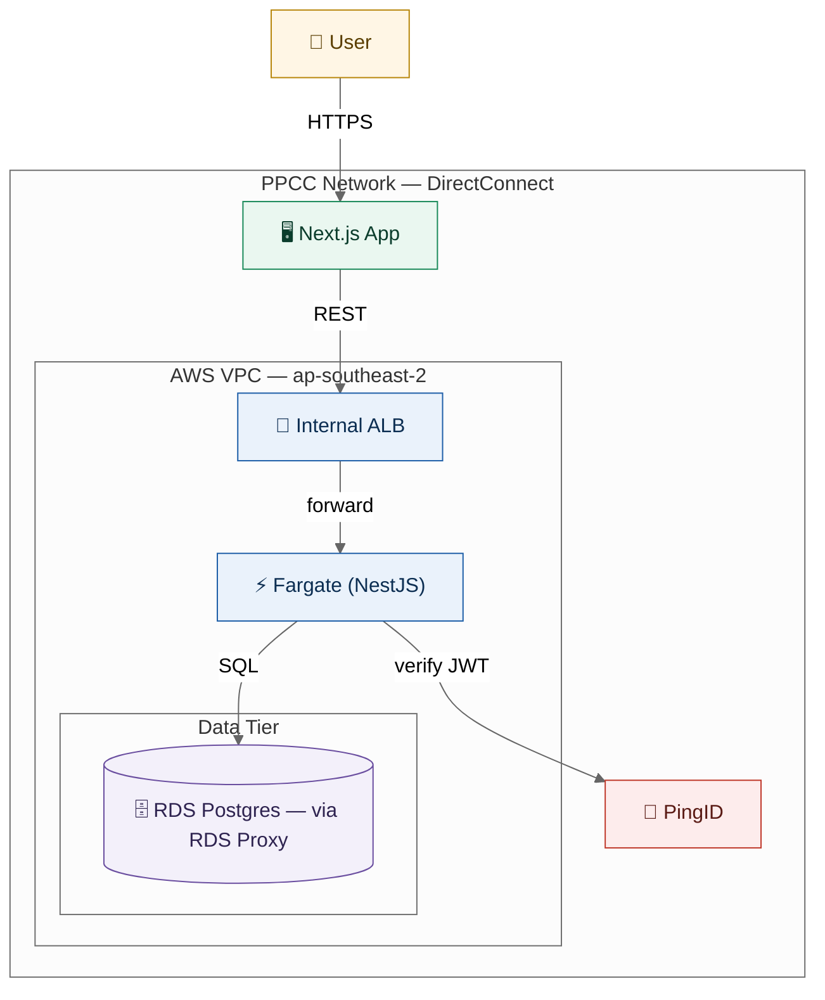
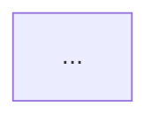

# Mermaid Diagram Standards

> **Canonical rules for every Mermaid diagram in this project** — whether Claude
> authors it from requirements (`/diagram-create`, spec generation, ADRs,
> `/design-architecture`) or converts it from an image
> (`/convert-image-to-mermaid`). Enterprise-grade: these diagrams may be shown to
> customers, so quality, consistency, and correctness are non-negotiable.

## Render Target (decides icon strategy)

**This project renders Mermaid on open-source renderers** — GitHub markdown,
VS Code preview, `mermaid.live`, docs viewers, and `mermaid-cli`. Therefore:

- **DO** use portable syntax that renders identically everywhere.
- **DO NOT** use `icon: "aws:arch-..."` or `service x(logos:aws-fargate)` — the
  `aws:` prefix is a **Mermaid Chart (commercial) feature**, and iconify packs
  require a `registerIconPacks(...)` call the renderer cannot make on GitHub or
  `mermaid.live`. They render **blank/broken** on our targets.
- Icons are therefore **emoji/Unicode**, used **sparingly** (see Icon Vocabulary).

If a diagram is ever produced specifically for **Mermaid Chart / a customer
deck** and richer AWS logos are wanted, that is an explicit, per-diagram
exception — note it in the diagram's surrounding text; the default stays
portable.

---

## Icon Vocabulary (emoji — sparing, one per node ROLE)

Use an icon to signal a node's **role**, not as decoration. **At most one icon
per node**, and only where it aids scanning. Plain nodes are fine — a diagram
where every node has an emoji is worse, not better. Never put an icon on edges,
on subgraph titles, or repeated across many sibling nodes of the same kind.

| Role | Icon | Example label |
| --- | --- | --- |
| Human actor / end user | 👤 | `User["👤 Trader"]` |
| CDN / edge | 🌐 | `CF["🌐 CloudFront"]` |
| API gateway / entrypoint | 🚪 | `GW["🚪 API Gateway"]` |
| Compute / service (Fargate, NestJS) | ⚡ | `API["⚡ Fargate (NestJS)"]` |
| Frontend app | 🖥️ | `Web["🖥️ Next.js"]` |
| Relational database | 🗄️ | `RDS[("🗄️ RDS Postgres")]` |
| Cache / in-memory | ⚡ (avoid clash) → 🧊 | `Cache[("🧊 Redis")]` |
| Auth / identity | 🔐 | `Auth["🔐 PingID"]` |
| Queue / event bus | 📨 | `Bus["📨 EventBridge"]` |
| Object storage | 🪣 | `S3[("🪣 S3")]` |
| External third-party system | 🔗 | `Ext["🔗 Murex Feed"]` |
| Scheduled job / cron | ⏱️ | `Job["⏱️ Nightly EOD"]` |
| Secret / config store | 🔑 | `Sec["🔑 Secrets Manager"]` |

Rules:

- Prefer **no icon** on generic decision/process nodes in flowcharts (`{…}`,
  `[…]`) — icons belong on *system/component* nodes in architecture diagrams.
- Never use more than **one** emoji in a single label.
- Do not use emoji as a substitute for a clear text label — the text must stand
  alone if the emoji fails to render.

---

## Diagram Type Selection

Pick the Mermaid type that matches the intent. Do not force everything into
`flowchart`.

| Intent / source | Mermaid type | Notes |
| --- | --- | --- |
| System/cloud architecture, deployment topology | `flowchart` (`graph`) with `subgraph` boundaries | Our default for AWS architecture (portable). Group by trust/network boundary. |
| Process / decision logic, business workflow | `flowchart TD`/`LR` | Use decision `{…}`, start/end `([…])`. |
| Interaction over time (auth, request lifecycle, integrations) | `sequenceDiagram` | One per major flow. Show actors + participants. |
| Data model / entities | `erDiagram` | Match the Prisma schema; PK/FK, cardinalities. |
| Entity lifecycle / status machine | `stateDiagram-v2` | For anything with a status field. |
| Data Flow Diagram (DFD) | `flowchart` with the DFD convention below | Mermaid has no native DFD type. |
| Class/object structure | `classDiagram` | Rare here; use when modelling OO structure. |
| Roadmap / timeline | `timeline` or `gantt` | Planning artifacts only. |

**DFD convention** (since Mermaid has no DFD type): external entities =
rectangles `[ ]`; processes = rounded `( )`; **data stores = `[( )]`** labelled
`D1 | Name`; data flows = labelled edges. State this legend in the surrounding
text when emitting a DFD.

---

## Structure & Layout Conventions

- **Direction**: `TB`/`TD` for architecture and hierarchies; `LR` for pipelines,
  sequences of stages, and wide flows. Choose the one that minimises edge
  crossings.
- **Boundaries**: model every trust/network boundary as a `subgraph` — at
  minimum for AWS work: an outer boundary for the **PPCC Network
  (DirectConnect)**, an inner **AWS VPC (ap-southeast-2)**, and separate the
  **data tier**. Auth/identity sits at the boundary it guards.
- **Node IDs**: short, stable, `PascalCase` or `UPPER` (`ALB`, `Fargate`,
  `RDS`). Human text goes in the **label**, not the ID.
- **Labels**: quote any label containing spaces/punctuation:
  `Fargate["⚡ Fargate (NestJS)"]`. Keep labels concise; put detail in edge labels
  or surrounding prose.
- **Edges**: label edges with the action or protocol (`-->|JWT|`,
  `-->|SQL/RDS Proxy|`, `-->|publishes event|`). Prefer a few well-labelled edges
  over many bare arrows.
- **Node shapes** carry meaning: `[ ]` service/component, `[( )]` datastore,
  `(( ))` boundary/actor pool, `{ }` decision, `([ ])` start/end,
  `[[ ]]` subroutine/managed service.
- **Size discipline**: if a single diagram exceeds ~25–30 nodes, split it (e.g. a
  context diagram + per-module detail diagrams) rather than shipping an
  unreadable wall.

---

## Enterprise Theme (PPCC-tinted, applied via `classDef`)

Apply these classes so diagrams are consistent and presentable. Colours are
chosen for contrast and print/screen legibility; override centrally if/when a
theme is applied in `@.claude/standards/design-tokens.md` (the palette below is
the default until then). Always place a `%%{init}%%` neutral base so themes
render predictably on light and dark backgrounds.



Palette reference (keep these names stable):

| Class | Use for | Fill | Stroke |
| --- | --- | --- | --- |
| `actor` | human users / external actors | `#FFF6E5` | `#B8860B` |
| `edge` | edge/frontend/CDN tier | `#EAF7F0` | `#1B8A5A` |
| `vpc` | compute inside the VPC | `#EAF2FB` | `#1E5FA8` |
| `data` | datastores / data tier | `#F3F0FA` | `#6B4FA0` |
| `auth` | auth / identity / security | `#FDECEC` | `#C0392B` |

Do not invent ad-hoc colours per diagram — reuse these classes so every diagram
in the project reads the same way.

---

## Accessibility (required)

Every diagram MUST declare a title and description so it is meaningful to screen
readers and self-documenting:



- Do not rely on colour alone to convey meaning — colour reinforces the class
  role, but the **label text** must carry the meaning.
- Keep contrast high (the palette above meets this); never light-grey text on a
  light fill.

---

## Correctness & Portability Checklist (run before declaring a diagram done)

1. **Parses** — the block is valid Mermaid (no unclosed subgraphs, balanced
   brackets, quoted labels with spaces). Mentally parse it top to bottom.
2. **Portable** — no `aws:` icons, no `registerIconPacks`, no Chart-only syntax.
3. **Typed correctly** — the diagram type matches intent (see selection table).
4. **Iconed sparingly** — ≤1 emoji per node, only on role-bearing nodes.
5. **Themed** — uses the `classDef` palette; boundaries are `subgraph`s.
6. **Accessible** — has `accTitle` + `accDescr`.
7. **Labelled edges** — non-trivial edges say what they carry.
8. **Sized** — ≤ ~30 nodes, else split.

---

## Rendering to Image (export)

Authoring needs **no renderer** — the ```` ```mermaid ```` block renders in
GitHub, VS Code, and `mermaid.live` directly. When a diagram must become a
**standalone image** (for a document export, a slide, or an external deck), that
is `/export`'s job:

- `/export <file>.md --to png|svg|pdf` (or `scripts/export-doc.ts mermaid`)
  extracts each ```` ```mermaid ```` block and renders it via
  `npx -y @mermaid-js/mermaid-cli` (fetched on first use; needs network) with a
  transparent background.
- **SVG** for PDF/HTML/reveal.js (crisp), **PNG** for DOCX/PPTX (most reliable).
- The portability rules above still apply — mermaid-cli is an open-source
  renderer, so no `aws:` icons / `registerIconPacks`.
- Every exported image carries **alt text** from its `accTitle`/`accDescr`
  (another reason both are required).

See `@.claude/commands/export.md` and
`@.claude/standards/document-export-standards.md`.

---

## Anti-Patterns (reject these)

- ❌ `icon: "aws:arch-aws-fargate"` / `service db(logos:aws-rds)` — blank on our
  renderers.
- ❌ Emoji on every node, or multiple emoji per label.
- ❌ Colours hard-coded per node with inline `style` instead of shared
  `classDef` classes.
- ❌ One giant flowchart standing in for a sequence, ER, or state diagram.
- ❌ Bare arrows with no labels across an architecture diagram.
- ❌ Human-readable text jammed into node IDs (`API_Gateway_HTTP_API_v2` as an
  ID) instead of the label.
- ❌ Missing `accTitle`/`accDescr`.

---

## Cross-References

- Authoring command: `@.claude/commands/diagram-create.md`
- Image conversion command: `@.claude/commands/convert-image-to-mermaid.md`
- Architecture design: `@.claude/commands/design-architecture.md`
- Render to image (export): `@.claude/commands/export.md` + `scripts/export-doc.ts`
- ADRs: `@.claude/templates/adr-template.md`
- Theme source (override palette here once a theme is applied):
  `@.claude/standards/design-tokens.md`

## Token Optimization

**Load when**: generating or converting ANY Mermaid diagram (specs, ADRs,
architecture, `/diagram-create`, `/convert-image-to-mermaid`).
**Load only**: this file (+ `design-tokens.md` if a custom theme is applied).
**Unload after**: the diagram is emitted and passes the checklist.
