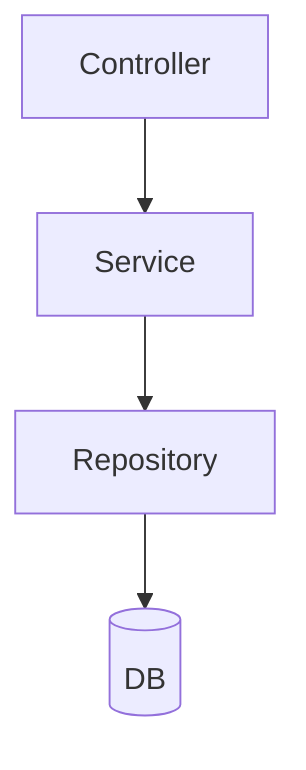
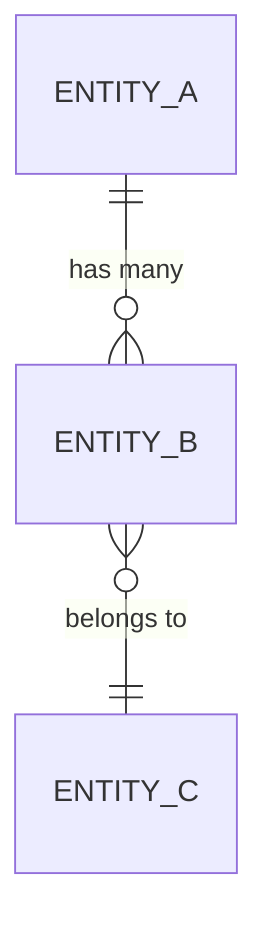
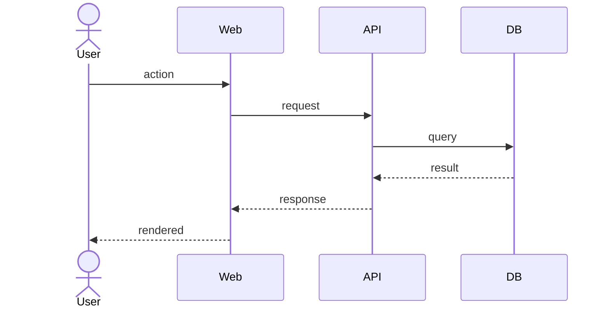
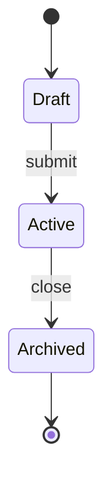
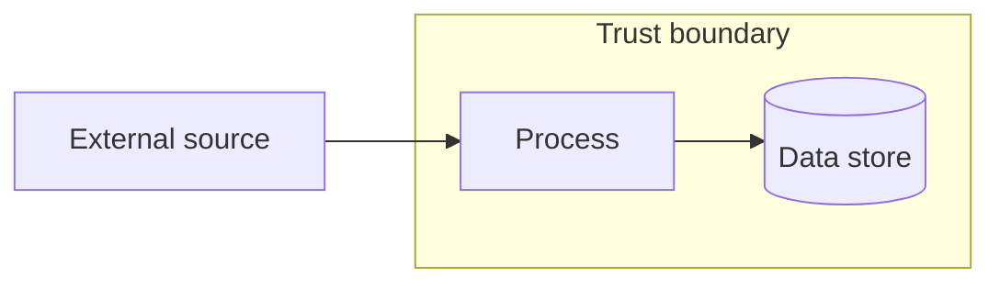

# Architecture Diagrams: [Application Name]

> **Instructions for use**: This is the **master diagram library** sibling of
> the BRD/FS. It holds full-system, master-scope diagrams; downstream
> `/create-epics` and `/create-epic-tasks` extract **scoped** slices from these
> masters per epic/task. Replace all `[placeholders]`. Delete diagram types that
> add nothing for this application.
>
> **Always a single file.** `specs/architecture-diagrams.md` is always one file
> with all diagrams inline — no `specs/architecture-diagrams/` subdirectory.
> Use stable heading anchors per diagram (e.g. `#system-context`,
> `#post-fulfilment-data-flow`) so `business-requirements.md` and
> `functional-specifications.md` can deep-link directly to individual diagrams.
>
> **Every diagram MUST follow the binding standard**
> `@.claude/standards/mermaid-standards.md` (portable syntax, sparing emoji,
> `classDef` theme, `subgraph` boundaries, `accTitle`/`accDescr`). Authoring
> examples: `.claude/commands/diagram-create.md`.
>
> Last updated: YYYY-MM-DD

---

## Index

> Each row links to a heading anchor below (e.g. `#01-system-context`).

| # | Diagram | Type | Scope | Consumed by |
|---|---|---|---|---|
| 01 | System Context | C4 context | Whole system + neighbours | FS §Integration, strategy §5 |
| 02 | Container | C4 container | Deployable units | FS §Tech Stack, epics (infra) |
| 03 | Component | C4 component | Module internals | epics (per module) |
| 04 | Domain / ER | ER diagram | Full data model | data-dictionary, DB epics |
| 05 | Sequence — [flow] | Sequence | One key flow | FS §feature, relevant epic |
| 06 | State — [entity] | State | One lifecycle entity | FS §feature, relevant epic |
| 07 | Data Flow | DFD | Data movement + trust boundaries | FS §Integration, security |

---

## 01 — System Context (C4)

```mermaid
flowchart TB
  accTitle: System context
  accDescr: [Application] and the external actors and systems it interacts with.
  actor[User / Role]
  subgraph sys[[Application Name]]
    core[Application]
  end
  ext1[[External System 1]]
  ext2[[External System 2]]
  actor --> core
  core --> ext1
  core --> ext2
```

_Source:_ [where this derives from — strategy ADR, source artefact, etc.]

---

## 02 — Container (C4)

```mermaid
flowchart TB
  accTitle: Container view
  accDescr: Deployable containers and their runtime relationships.
  subgraph app[[Application Name]]
    web[Web — NextJS]
    api[API — NestJS/Fargate]
    db[(PostgreSQL — RDS)]
    bus[(EventBridge / SQS)]
  end
  web --> api --> db
  api --> bus
```

---

## 03 — Component (C4)



---

## 04 — Domain / ER Diagram

> Master ER for the whole domain model. The column-level detail lives in the
> data dictionary; this diagram shows entities, keys, and cardinalities.



_Source:_ `specs/data-dictionary.md`

---

## 05 — Sequence: [Key Flow Name]



> Add one sequence diagram per major flow (auth, primary use cases,
> integrations). Multiples of the same type are expected.

---

## 06 — State: [Entity With Lifecycle]



> One state diagram per entity that has a non-trivial lifecycle.

---

## 07 — Data Flow Diagram



---

## Diagram Maintenance Rule

When the domain model, integrations, or a lifecycle changes, update the master
diagram here **first**, then let downstream epics/tasks re-extract their scoped
slices. Never let a scoped epic diagram diverge silently from these masters.
