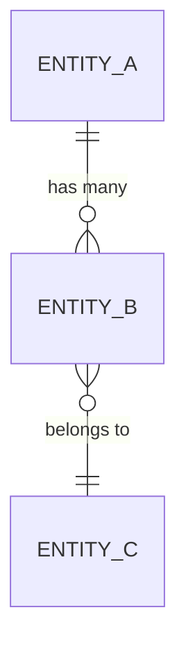

# Data Dictionary: [Application Name]

> **Instructions for use**: This is the **authoritative field-level data
> reference** sibling of the BRD/FS. It is the single source of truth for every
> stored entity, column, enum, and relationship. `functional-specifications.md`
> references this document rather than duplicating column tables. Replace all
> `[placeholders]`; delete sections that do not apply.
>
> **Always a single file.** `specs/data-dictionary.md` is always one file
> regardless of schema size. Use stable heading anchors per storage area /
> bounded context (e.g. `#feature-03-entities`) so `business-requirements.md`
> and `functional-specifications.md` can deep-link to individual sections.
>
> **Project:** [Project Name]
> **Schema Version:** [Prisma Schema Version]
> **Last Updated:** YYYY-MM-DD
> **Generated from:** `packages/database/prisma/schema.prisma`

---

## 1. Storage-Model Map

> Show, at a glance, where each part of the domain lives and by what mechanism
> (relational table, JSONB column, enum, derived/read model, external system).
> This is critical for hybrid designs (relational core + JSONB elections, etc.).

| Namespace / Concept | Storage Mechanism | Location | Notes |
|---|---|---|---|
| [Core entity] | Relational table | `[table]` | System of record |
| [Variable/elective data] | JSONB column | `[table].[column]` | Schema-validated by Zod at write time |
| [Reference data] | Enum | Prisma enum `[Enum]` | Closed set |
| [Externally-mastered data] | Not stored | External: [system] | Only approved identifier persisted (see strategy P-00X) |
| [Search/read model] | Derived | [where] | Rebuildable from source of record |

---

## 2. Entity-Relationship Diagram

> Master ER (also mirrored in `specs/architecture-diagrams/`). Follow
> `@.claude/standards/mermaid-standards.md`.



---

## 3. Relational Tables

### `[table_name]`

**Description:** [What this table represents in business terms; system of record?]

| Column | Type | Nullable | Default | FK | Index | Description |
|--------|------|----------|---------|-----|-------|-------------|
| id | CUID | No | cuid() | — | PK | Unique identifier |
| created_at | TIMESTAMPTZ | No | NOW() | — | — | Record creation timestamp (UTC) |
| updated_at | TIMESTAMPTZ | No | NOW() | — | — | Last update timestamp (auto-managed) |
| deleted_at | TIMESTAMPTZ | Yes | NULL | — | ✅ | Soft-delete timestamp |
| [field] | [type] | Yes/No | [default] | [ref] | [idx] | [description + validation rule] |

**Constraints:**
- `[name]` — UNIQUE ([cols])
- `[name]` — FK → `[table].[col]` ON DELETE [RESTRICT/CASCADE/SET NULL]
- `[name]` — CHECK ([condition])

**Indexes:**
- `[table]_[cols]_idx` — ([cols]) [partial predicate if any]

**Business Rules:**
- [Rule that governs this table's data — cite BR-/rule ID where possible]

**Traceability:** [BR/FS IDs, source artefact in `specs/reference/`]

---

### `[next_table]`

[Repeat for each table.]

---

## 4. JSONB / Semi-Structured Columns

> For hybrid designs, document the *shape* of each JSONB payload — it is still a
> contract even though the DB stores it opaquely. Give the validating Zod schema
> location and a worked example.

### `[table].[jsonb_column]`

**Purpose:** [Why this is JSONB rather than columns — variability, sparse,
elective, versioned payload, etc. Cite strategy ADR.]

**Validated by:** `packages/validation/[schema].ts` → `[ZodSchema]`

| Path | Type | Required | Description |
|---|---|---|---|
| `$.field` | string | Yes | [meaning + constraints] |
| `$.nested.field` | number | No | [meaning] |

**Example:**

```json
{ "field": "value", "nested": { "field": 1 } }
```

---

## 5. Enumerations

| Enum | Values | Used In | Description |
|------|--------|---------|-------------|
| [Enum] | value_a, value_b, value_c | `[table].[column]` | [meaning of each value] |

---

## 6. Data Ownership & System of Record

> Which system masters each data class — essential where some data is
> externally mastered and only referenced locally.

| Data Class | System of Record | Stored Locally? | What is persisted |
|---|---|---|---|
| [class] | This application | Yes | Full record |
| [class] | [External system] | No — reference only | [approved identifier only] |

---

## 7. Naming Conventions

- Tables: `snake_case`, plural (e.g., `audit_logs`)
- Columns: `snake_case` (e.g., `first_name`)
- PKs: `id` (CUID)
- FKs: `{entity}_id` (e.g., `org_id`)
- Timestamps: `created_at`, `updated_at`, `deleted_at`
- Booleans: `is_{state}` (e.g., `is_verified`)
- Enums: `PascalCase` name, `snake_case` or `SCREAMING_SNAKE` values (be consistent)
- Indexes: `{table}_{column(s)}_idx`
- JSONB paths: documented with JSONPath (`$.field`)

---

## 8. Revision History

| Version | Date | Author | Changes |
|---|---|---|---|
| 0.1 | YYYY-MM-DD | [Author] | Initial draft |

---

> **AI Usage Note**: This is the authoritative data contract. When Prisma schema
> changes, update this document in the same change. Downstream epics/tasks must
> cite the table/column/enum names here rather than inventing new ones.
