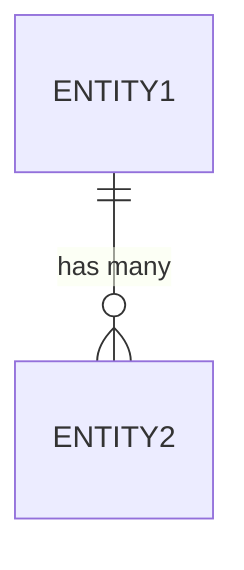
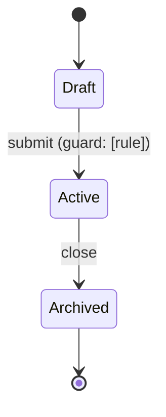
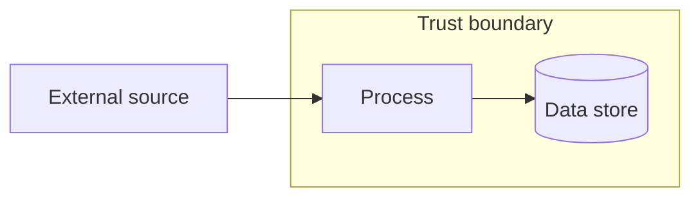
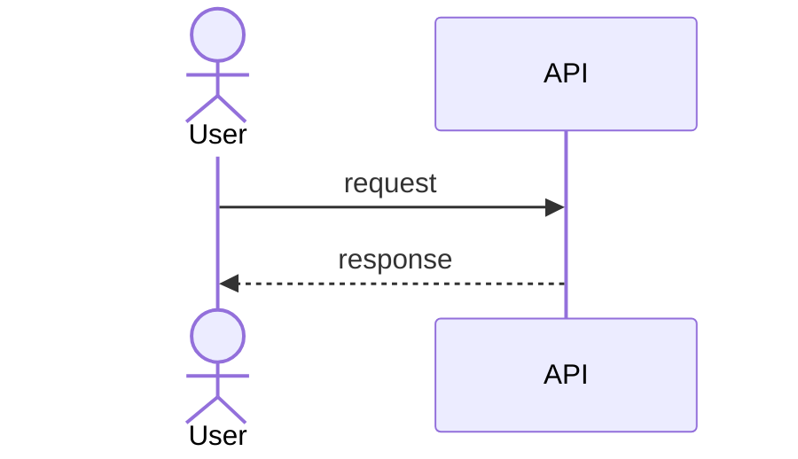

# Functional Specification: [Application Name]

> **Instructions for use**: Replace all `[placeholders]` with your
> application details. Delete sections that do not apply.
> This document is read by the AI before every task — keep it accurate.
> For complex banking/finance apps it is expected to be **detailed and
> implementation-ready**: entities/fields, endpoints, validation, RBAC, events,
> state machines, screens/navigation, and design diagrams. Depth over brevity.
> Last updated: YYYY-MM-DD
>
> **Always a single file.** `specs/functional-specifications.md` is ALWAYS
> generated as one file — never split into a directory. Use clear `##`/`###`
> headings with stable section anchors so other documents can deep-link to a
> section.
> This file is the **technical source of truth**: every relevant section of
> `strategy.md`, `data-dictionary.md`, `architecture-diagrams.md`, and
> `requirements-traceability-matrix.md` MUST be referenced here by a relative
> link. All `specs/reference/` artefacts that this document uses MUST have a
> `_Source:_` relative link from the consuming section.

---

## 0. Related Documents

This FS is the technical source of truth and the AI's primary reference. It
works alongside these siblings — reference them rather than duplicating detail:

- **Business requirements (the "what/why"):** `specs/business-requirements.md`
- **Strategy & key decisions:** `specs/strategy.md`
- **Data dictionary (field-level contract):** `specs/data-dictionary.md`
- **Architecture diagrams (master scope):** `specs/architecture-diagrams.md`
- **Requirements traceability:** `specs/requirements-traceability-matrix.md`
- **Source artefact library:** `specs/reference/README.md`

`_Source:_` pointers must resolve **inside `specs/reference/`**, never into the
temporary input folder.

---

## 1. Vision

### Problem Statement

[One paragraph: what problem does this application solve?]

### Target Users

[Who uses this application? e.g., PPCC internal staff, customers, partners]

### Business Value

[What measurable outcomes does this deliver?
e.g., reduce manual processing time by X%, improve customer NPS by Y points]

---

## 2. Users and Roles

| Role | Description | PingID Scope | Access Level |
|---|---|---|---|
| Admin | [Description] | `{resource}:admin` | Full access |
| Manager | [Description] | `{resource}:write` | Create, edit, view |
| Viewer | [Description] | `{resource}:read` | Read only |
| [Custom Role] | [Description] | `{resource}:custom` | [Access] |

### Authentication

- Provider: PingID (PPCC standard)
- MFA: Required for all users — no exceptions
- Session: httpOnly cookie, 8-hour expiry
- All routes protected: yes (NextJS middleware + NestJS JwtAuthGuard + PermissionsGuard)

---

## 3. Core Features

> List features in priority order. Mark status for existing projects.

### Feature 1: [Name]

- **Status**: Planned / In Progress / Complete
- **Description**: [What it does]
- **Users**: [Which roles use this]
- **Priority**: Must Have / Should Have / Could Have
- **Stories**: [US-IDs from `specs/business-requirements.md` §5a]
- **Traceability**: [BR-IDs] · [source artefact in `specs/reference/`]

**Implementation-ready detail** (terse and structured — the primary consumer is
an AI agent; depth over prose):

- **Entities touched:** [entity names → see data dictionary]
- **API endpoints:**

  | Method | Path | Request | Response | Status codes | Permission |
  |---|---|---|---|---|---|
  | GET | `/[resource]` | — | `[Shape][]` | 200, 401, 403 | `{resource}:read` |
  | POST | `/[resource]` | `Create[Shape]` | `[Shape]` | 201, 401, 403, 422 | `{resource}:write` |

- **Validation rules (Zod-level):** [min/max, formats, enums, refinements]
- **RBAC:** [which role/scope may perform each operation]
- **Domain events:** [published/consumed events + payload shape]
- **Error & edge cases:** [what fails, what the caller sees]
- **State transitions:** [if this feature drives an entity lifecycle — cite §6 state diagram]

### Feature 2: [Name]

[Repeat the full structure above for each feature.]

### Feature 3: [Name]

[Continue pattern...]

---

## 4. Non-Functional Requirements

### Performance

| Metric | Target | Alert Threshold |
|---|---|---|
| API response P50 | < 200ms | > 500ms |
| API response P99 | < 1000ms | > 2500ms |
| Page load (FCP) | < 2s | > 3s |
| Fargate scale-out | < 60s for new task | > 120s |
| DB query P99 | < 100ms | > 500ms |

### Availability

| Environment | Target | Maintenance Window |
|---|---|---|
| Production | 99.9% | Sunday 2am-4am AEST |
| Staging | 99.5% | As needed |
| Dev | Best effort | As needed |

### Security

- Authentication: PingID MFA — all routes, no exceptions
- Authorisation: RBAC via PingID scopes
- Network: AWS DirectConnect — no public AWS endpoints
- Data residency: ap-southeast-2 only
- Compliance: APRA CPS 234
- PII handling: [List PII data types this app handles]
- Encryption: TLS 1.2+ in transit, AES-256 at rest

### Scalability

- Expected concurrent users: [N]
- Peak load: [N requests/second]
- Data volume: [N records, growth rate]

---

## 5. Technical Stack

### Frontend

- Framework: NextJS 16 (App Router)
- Language: TypeScript 6.x
- UI Library: project-configured (see CLAUDE.md)
- State: TanStack Query (server) + Zustand (client)
- Forms: React Hook Form + Zod
- Testing: Jest + RTL, Playwright

### Backend

- Language: TypeScript 5.x
- Framework: NestJS 11
- Runtime: Node 20 — AWS Fargate (Fastify container behind an internal ALB); batch jobs as scheduled ECS tasks, event workers as SQS-polling Fargate services
- API: OpenAPI 3.0 (Zod-first: Prisma → zod-prisma-types → @asteasolutions/zod-to-openapi)
- ORM: Prisma (PostgreSQL)
- Migrations: Prisma Migrate (with seed data in prisma/seed.ts)
- Testing: Jest, @nestjs/testing, Testcontainers, supertest

### AWS Infrastructure

- Compute: AWS Fargate (NestJS 11 + Node 20, deployed via AWS CDK v2); internal ALB
- Auth: In-app NestJS JwtAuthGuard (passport-jwt + jwks-rsa, PingID RS256/JWKS)
- Database: RDS PostgreSQL 16 (Multi-AZ DatabaseInstance, RDS Proxy)
- Messaging: SNS + SQS
- Secrets: AWS Secrets Manager
- Monitoring: CloudWatch, X-Ray
- IaC: AWS CDK v2 (TypeScript)
- Region: ap-southeast-2 only
- Network: VPC private subnets, AWS DirectConnect

### PPCC Platforms

- Auth: PingID
- Design system: see `.claude/docs/component-library.md` for patterns
- Design MCP: design system MCP (if configured for this project)
- Framework docs/examples: Context7 MCP (`https://mcp.context7.com/mcp`)
- Engineering standards: CEB MCP (`https://ceb.ppcc/mcp`)
- Business events: Observe
- Logging: CloudWatch + Observe

---

## 6. Domain Model

> Core domain entities and relationships. **Field-level detail (types,
> nullability, constraints, enums, JSONB shapes) lives in the data dictionary** —
> reference it here, do not duplicate the column tables.

### Entities

| Entity | Description | Key Attributes | System of Record |
|---|---|---|---|
| [Entity1] | [What it represents] | id, name, status, ... | This app / [external] |
| [Entity2] | [What it represents] | id, [entity1]_id, ... | This app |

### Key Relationships

- [Entity1] has many [Entity2]
- [Entity2] belongs to [Entity1]
- [Add more as needed]

### ER Diagram

> Master ER also lives in `specs/architecture-diagrams/`. Follow
> `@.claude/standards/mermaid-standards.md`.



> Full field-level contract: `specs/data-dictionary.md`.

### State Diagrams

> One per entity with a non-trivial lifecycle. Document valid states,
> transitions, and the trigger/guard for each transition.



**Invariants:** [rules that must hold across all states — e.g. an Active
[entity] always has [X]].

---

## 7. Integration Points

### Internal PPCC Systems

| System | Integration Type | Purpose | Access |
|---|---|---|---|
| PingID | Auth (OAuth 2.0) | Authentication | DirectConnect |
| Observe | HTTP/SDK | Business event logging | DirectConnect |
| [System] | [Type] | [Purpose] | DirectConnect |

### External Systems

| System | Integration Type | Purpose | Notes |
|---|---|---|---|
| [System] | REST API | [Purpose] | Via internal API Gateway endpoint |

### AWS Services

| Service | Purpose | Notes |
|---|---|---|
| RDS PostgreSQL | Primary data store | Multi-AZ, RDS Proxy |
| SNS | Domain event publishing | [Topic names] |
| SQS | Async processing queues | DLQ configured |
| Secrets Manager | Credentials management | Rotation enabled |
| CloudWatch | Technical logging + metrics | |
| X-Ray | Distributed tracing | |

### Data Flow Diagram

> How data moves between actors, processes, stores, and external systems, with
> trust boundaries. Follow `@.claude/standards/mermaid-standards.md`.



### Sequence Diagrams (key flows)

> One per major flow (auth, primary use cases, integrations).



---

## 7a. Screens & Navigation

> The UI surface: every screen, its purpose, the roles that reach it, and how a
> user navigates between them. Reference the Figma-node mirror in `figma/nodes/<slug>`
> (produced by the Figma sync in Phase 3) and existing Lumen-based components in
> `apps/web/src/components/` where they exist.

### Screen Inventory

| Screen | Route | Purpose | Roles | Key Components | Figma Node |
|---|---|---|---|---|---|
| [Screen] | `/[route]` | [purpose] | [roles] | [component names] | `figma/nodes/<slug>` |

### Navigation Map

```mermaid
flowchart LR
  accTitle: Navigation map
  accDescr: How users move between screens.
  login[/Login/] --> home[Home]
  home --> list[[Resource] list]
  list --> detail[[Resource] detail]
```

### Screen Detail: [Screen Name]

- **Purpose:** [what the user accomplishes here]
- **Entry points:** [how the user arrives]
- **Primary actions:** [buttons/actions → which endpoint each calls]
- **States:** [empty / loading / error / success / permission-denied]
- **Validation & errors:** [inline validation, error surfacing per RFC 7807]

---

## 8. Constraints and Assumptions

### Hard Constraints (Cannot Change)

- AWS DirectConnect mandatory for all AWS access
- PingID authentication — no alternatives
- project-configured UI library (see CLAUDE.md)
- Data must remain in ap-southeast-2
- APRA CPS 234 compliance required
- All secrets via Secrets Manager — no env vars

### Assumptions

- [Assumption 1 — e.g., "Users will have PPCC Active Directory accounts"]
- [Assumption 2]
- [Add more as needed]

### Out of Scope

- [Item 1 — e.g., "Mobile application — web only"]
- [Item 2]

---

## 9. Known Technical Debt
>
> For existing projects only. Delete for greenfield.

| Item | Impact | Priority | Owner |
|---|---|---|---|
| [Debt item] | [High/Med/Low] | [Sprint N] | [Team] |

---

## 10. Open Questions

| # | Question | Owner | Due | Status |
|---|---|---|---|---|
| 1 | [Question] | [Name] | YYYY-MM-DD | Open |

---

## 11. Requirements Traceability

> Maintain a full BR → FS → Story → Test matrix in the sibling document so no
> requirement is orphaned and every requirement is testable.

- **Matrix:** `specs/requirements-traceability-matrix.md`
- Template: `@.claude/templates/requirements-traceability-matrix.md`
- Every feature (§3) and story (BRD §5a) must appear as a row with at least one
  linked test case before it is considered specification-complete.

---

## 12. Revision History

| Date | Author | Changes |
|---|---|---|
| YYYY-MM-DD | [Author] | Initial draft |

---

> **AI Usage Note**: This document is automatically read by the AI framework
> before every task. Keep it up to date as requirements evolve. It references
> its siblings (§0) rather than duplicating them — the data dictionary,
> strategy, architecture diagrams, RTM, and `specs/reference/` source library
> together form the complete, self-contained picture.
> Reference: `@.claude/CLAUDE.md` for framework usage.
