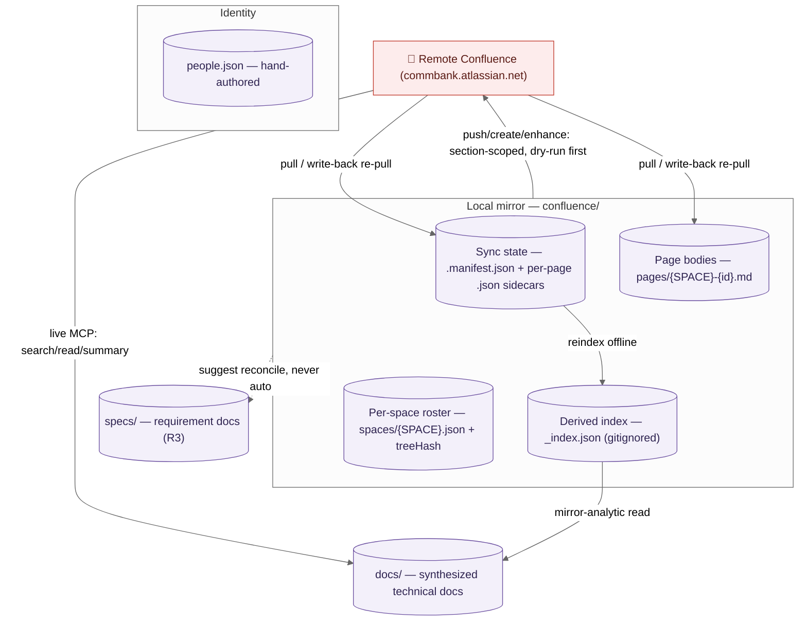

# Confluence Operating Guide

> The single human reference for operating the local Confluence integration in
> this repo. It documents the **as-built** system — every command, flag, and
> behaviour here was transcribed from the actual files under
> `.claude/commands/confluence*.md`, `.claude/agents/confluence-search.md`,
> `.claude/config/confluence-sync.config.yml`, the scripts under
> `scripts/confluence/`, and the state files under `confluence/`. Where a detail
> is load-bearing, this guide links to the source file rather than duplicating
> its full contract.

**Project:** Confluence on `commbank.atlassian.net` (cloudId
`998e78d7-2a66-4fc0-809b-b43b4232d4b8`). Spaces in scope: **SEC** (CITB Solution
— Entity onboarding) and **PCON** (CommBiz Reinvented — Admin Hub 2.0 — Party
Credentials Management). Access is via the Atlassian MCP (`mcp__atlassian__*`) —
**the session brokers auth; there are no secrets to manage or document.** The
cloudId is a pinned config value, never hand-typed.

For the **JIRA** integration, see `docs/JIRA-OPERATING-GUIDE.md`. Identity/alias
mechanics and `people.json` are shared across both integrations — see §7 below.

---

## 1. What this is — Rovo-first discovery + citation-cache mirror

The Confluence integration has **two distinct modes** that must never be
confused:

| Mode                                | What it uses                                              | When staleness matters                   |
| ----------------------------------- | --------------------------------------------------------- | ---------------------------------------- |
| **Live discovery / read / summary** | Atlassian MCP → Rovo `search` / `getConfluencePage` / CQL | **Never** — always fresh from Confluence |
| **Mirror-derived answers**          | Local `confluence/` cache pulled by `/confluence pull`    | **Yes** — 24-hour staleness gate applies |

**The thesis:** Rovo `search` is the org-wide primary discovery engine. The
local mirror under `confluence/` is a citation cache — it caches pages that live
answers have referenced, so future answers can be served offline, cited to a
pinned version, and diff'd against the remote. The mirror is not the index; it
does not need to be populated for discovery to work.

**When to use this vs the JIRA integration:**

- Use the Confluence integration to _discover_ how things are documented (design
  docs, runbooks, decision records, space summaries).
- Use the JIRA integration to query and track work items (epics, tasks, sprints,
  backlogs).
- The two mirrors share identity (`people.json`) and are linked via the
  `/confluence relationship-map` verb.



### The core rule: ingest ≠ generate ≠ reconcile ≠ push (R3)

Four **distinct** operations with hard boundaries — confusing them is the main
way the mirror gets corrupted or specs get contaminated:

- **Ingest** (pull from Confluence → mirror) touches only `confluence/` + the
  manifest. It never writes `specs/`.
- **Generate** (`/create-specifications`) only _reads_ the mirror and live
  Confluence; it never writes into `confluence/`.
- **Reconcile** (`/reconcile-requirements`) is the **only** path from a changed
  mirror into `specs/` requirement docs. **No command ever auto-runs it** —
  write-backs only _suggest_ it.
- **Push** (write-back to Confluence) is **human-gated and dry-run-first**, and
  is **section-scoped only** (pushable `##` regions; never `## Comments`,
  `## Metadata`, or macro fences).
- **Synthesis** writes to `docs/`, never `specs/`.

---

## 2. Setup

### Config file

`.claude/config/confluence-sync.config.yml` — read by the `/confluence` router
and the `confluence-search` agent on every invocation:

```yaml
cloudId: '998e78d7-2a66-4fc0-809b-b43b4232d4b8'
site: 'commbank.atlassian.net'
stalenessHours: 24
pullComments: true
unresolvedAliasPolicy: 'ask'
spaces:
  - key: SEC
  - key: PCON
```

| Field                   | Effect                                                                                                                          |
| ----------------------- | ------------------------------------------------------------------------------------------------------------------------------- |
| `cloudId`               | Passed verbatim to every Atlassian MCP call. Never hardcoded elsewhere.                                                         |
| `site`                  | Display + URL construction only; auth is brokered by the MCP session.                                                           |
| `stalenessHours`        | Mirror-derived answers are stale when `now − _index.json.lastSyncedAt > 24h`. Live verbs are never gated.                       |
| `pullComments`          | When `true`, `/confluence pull` also fetches footer + inline comments alongside each page body.                                 |
| `unresolvedAliasPolicy` | `"ask"` — an unknown or ambiguous alias triggers a clarifying question; never a guess.                                          |
| `spaces[].key`          | In-scope spaces. Per-space optional `labels[]` / `ancestors[]` can narrow pull scope (currently commented out for broad scope). |

### `.gitignore`

`confluence/_index.json` is gitignored — it is a derived, regenerated artifact.
The committed files are the sidecars (`.json`) and body files (`.md`) under
`confluence/pages/`, `confluence/blogposts/`, `confluence/spaces/`, plus
`.manifest.json` and `manifest.schema.json`.

### On-disk structure (after first pull)

```
confluence/
  .manifest.json          — sync state: per-item pointers + intentKey records
  manifest.schema.json    — JSON schema for the manifest (committed)
  _index.json             — derived rollup (gitignored; rebuilt by /confluence reindex)
  spaces/
    SEC.json              — per-space roster + treeHash
    PCON.json
  pages/
    SEC-{id}.md           — page body with region markers
    SEC-{id}.json         — sidecar: version, contentHash, status_sync, …
    PCON-{id}.md
    PCON-{id}.json
  blogposts/              — same layout as pages/
  attachments/            — raw attachments per page id
  .push-runs/             — crash-safe intent records for write-back operations
```

### First-run initialisation

Two distinct steps — **scaffold** (offline) then **populate** (live pull):

1. **Scaffold the skeleton** (idempotent, offline — writes only
   `.claude/config/` + `confluence/`, no network):
   ```
   node_modules/.bin/tsx scripts/confluence/init.ts
   ```
   This creates `.manifest.json`, `manifest.schema.json`, and the directory tree
   (`spaces/ pages/ blogposts/ attachments/`). A re-run on an existing mirror
   **reports drift instead of overwriting** — the same contract as `/jira-init`.
   Use `--check` to preview drift without writing, `--selftest` to verify the
   script. In normal use the skeleton already exists (scaffolded once at setup),
   so you rarely run this by hand — it's the recovery path (see §6 "Mirror not
   initialised").
2. **Populate** the cache with a live pull:
   ```
   /confluence pull SEC
   /confluence pull PCON
   ```

No compiled TS install step is required — the scripts under
`scripts/confluence/*.ts` are invoked via `node_modules/.bin/tsx` (already
available in the monorepo dev deps).

### Identity

`.claude/config/people.json` is the single source of truth for all identity
data. Each person pulled from Confluence (as page author or comment author) is
appended **additively** to `people.json` (`aliases: []`, `confluence: <handle>`
when the MCP returns one — never invented). See also §7 (Identity & aliases) and
`docs/JIRA-OPERATING-GUIDE.md §4`.

---

## 3. Command reference

**The single most important safety takeaway:** only the three write-back verbs
(`push`, `create`, `enhance`) change remote Confluence. Every other verb is
either live-read (never stale-gated) or mirror-local. The "mutates remote?"
column means _does this command write to remote Confluence?_

### Live discovery (Phase 1 — never staleness-gated)

| Command                                          | What it does                                                       | Live or mirror?         | Mutates remote?                            |
| ------------------------------------------------ | ------------------------------------------------------------------ | ----------------------- | ------------------------------------------ |
| `/confluence search <query>`                     | Org-wide Rovo search → ranked, cited shortlist                     | **Live**                | No                                         |
| `/confluence read <url\|pageId>`                 | Fetch + digest a single page (+ subtree/comments when relevant)    | **Live**                | No                                         |
| `/confluence summary <SPACE> [--since <window>]` | Recent-changes summary for a space (mirror diff added in Phase 3)  | **Live** (window query) | No                                         |
| `/confluence "<natural language>"`               | Classify intent → delegate to search / read / summary / write-back | Depends on intent       | Mutation intents routed to write-back only |

**How natural-language classification works.** The router delegates to the
`confluence-search` subagent, which classifies the prompt into: _discovery_,
_read_, _summary_, _mirror-analytic_, or _mutation_. Mutation intents are never
performed inline — they are named and routed to the correct write-back verb.
Read-only intents are answered live, always cited.

### Glossary (Phase 2)

The glossary (`.claude/config/glossary.json`) is the framework's learned bank
vocabulary — shared cross-tool with JIRA. Term resolution runs automatically on
every discovery prompt (the agent expands acronyms like `NTB` → `New To Bank`
before querying). These verbs are the explicit entry points:

| Command                                            | What it does                                                                              | Live or mirror?         | Mutates remote? |
| -------------------------------------------------- | ----------------------------------------------------------------------------------------- | ----------------------- | --------------- |
| `/confluence glossary show <term>`                 | Look up a term in `glossary.json`; offer to resolve + persist (on confirmation) if absent | Local (`glossary.json`) | No              |
| `/confluence glossary harvest [<SPACE>\|<pageId>]` | Scan mirrored bodies for first-use expansions; batch-propose for confirm/reject           | Mirror                  | No              |

**Human-confirmed on write — no exceptions.** No term enters `glossary.json`
without explicit approval. Provenance is stored as pointers only — never secrets
or restricted body text.

**Glossary entry shape (`glossary.schema.json`).** Each term under `terms` is
keyed by its canonical display form (usually the acronym as written, e.g.
`POBO`) and carries:

| Field            | Required | Meaning                                                                                                                                                                                                                                                                                                                                                                                                      |
| ---------------- | -------- | ------------------------------------------------------------------------------------------------------------------------------------------------------------------------------------------------------------------------------------------------------------------------------------------------------------------------------------------------------------------------------------------------------------ |
| `expansion`      | **Yes**  | Full-text expansion (`"Payment On Behalf Of"`). Used to expand the query before Rovo/CQL.                                                                                                                                                                                                                                                                                                                    |
| `confirmedBy`    | **Yes**  | Must be the literal `"human"` — the schema `enum` allows no other value. An entry with any other `confirmedBy` is invalid and must not exist.                                                                                                                                                                                                                                                                |
| `definition`     | No       | One-to-two sentence plain-language meaning — **paraphrased**, never a verbatim copy of restricted content.                                                                                                                                                                                                                                                                                                   |
| `provenance[]`   | No       | Where the meaning was established. **Pointers only:** each item has a `source` (e.g. `"confluence:PCON:2042342654"`, `"jira:CANS-123"`, `"specs/business-requirements.md"`, or a URL) plus an optional short paraphrased `quote` and a `confidence` (`high`/`medium`/`low`). For a **restricted** source, keep the `source` pointer and set `quote` to `null` — the pointer is safe, the body is not copied. |
| `aliases[]`      | No       | Case/format variants that resolve here (`["pobo", "payment-on-behalf-of"]`), matched case-insensitively.                                                                                                                                                                                                                                                                                                     |
| `relatedTerms[]` | No       | Other glossary keys worth surfacing alongside (`POBO` → `["NTB", "delegated-authority"]`).                                                                                                                                                                                                                                                                                                                   |
| `confirmedAt`    | No       | ISO 8601 timestamp of the human confirmation.                                                                                                                                                                                                                                                                                                                                                                |

The schema is `additionalProperties: false` at both levels — an unknown field
fails validation. This is deliberate: the glossary is tool-neutral (no
JIRA/Confluence-specific fields) and stores meaning + pointers only, so a leaked
restricted phrase can never hide in an ad-hoc field.

### Mirror (Phase 3 — staleness-gated where noted)

| Command                                                    | What it does                                                                                                                                                                                                                                                                              | Live or mirror?                                                                    | Mutates remote?                        |
| ---------------------------------------------------------- | ----------------------------------------------------------------------------------------------------------------------------------------------------------------------------------------------------------------------------------------------------------------------------------------- | ---------------------------------------------------------------------------------- | -------------------------------------- |
| `/confluence pull <SPACE\|pageId\|url>`                    | Pull pages from Confluence into the local cache                                                                                                                                                                                                                                           | Live pull (advances `lastSyncedAt`)                                                | **No** (reads from Confluence)         |
| `/confluence reindex`                                      | Rebuild `confluence/_index.json` from sidecars (OFFLINE)                                                                                                                                                                                                                                  | Mirror                                                                             | **No** (no network)                    |
| `/confluence-sync [--pull] [--force-pull <SPACE\|pageId>]` | Whole-scope reconciliation — cheap `version.number` roster scan across all configured spaces, per-page `status_sync` diff, discovery of new/orphaned pages. Default **dry-run**; delegates body pulls to `/confluence pull` and the rollup to `/confluence reindex`. Twin of `/jira-sync` | Live scan; pulls only on `--pull` (advances `lastSyncedAt` via the delegated pull) | **No** (reads/exports from Confluence) |
| `/confluence space <SPACE>`                                | Tree/roster view from `spaces/{SPACE}.json` — pages, `treeHash`, `status_sync`                                                                                                                                                                                                            | Mirror (staleness-gated)                                                           | No                                     |
| `/confluence who <alias>`                                  | Resolve alias → handle; list pages the person authored or commented on                                                                                                                                                                                                                    | Mirror (staleness-gated)                                                           | No                                     |
| `/confluence tree [<pageId>]`                              | Ancestry/descendant Mermaid diagram from `_index.json.tree`                                                                                                                                                                                                                               | Mirror (staleness-gated)                                                           | No                                     |
| `/confluence gap <pageId>`                                 | Doc-rot heuristics over the mirrored body; suggests (never runs) an enhance                                                                                                                                                                                                               | Mirror (staleness-gated)                                                           | No                                     |
| `/confluence stale`                                        | List mirrored pages with `status_sync` = `remote-ahead` or `diverged`                                                                                                                                                                                                                     | Mirror (staleness-gated)                                                           | No                                     |

**`/confluence pull` detail.** The pull command:

1. Builds a scope-aware CQL query with a time window (default `30d`) — never
   unbounded.
2. Pages through the roster with `searchConfluenceUsingCql`, fetching each body
   as markdown.
3. Checks each page for hand-edits (do-not-clobber gate) before overwriting.
4. Appends new authors to `people.json` additively.
5. Advances `lastSyncedAt` in the sidecars; rebuilds the space roster +
   `treeHash`; runs `reindex`.

**`--descendants` — pull a page _and its whole subtree_.** By default
`/confluence pull <pageId>` pulls just that one page. Add `--descendants` to
also walk the child pages via `getConfluencePageDescendants`:

```
/confluence pull PCON-2042342654 --descendants
```

Use it when you want the full documentation branch (e.g. a design doc plus every
sub-page) in the mirror, not just the parent. Without the flag, children are
left un-mirrored and will surface as un-pulled in the space roster. A
space-level pull (`/confluence pull PCON`) already covers the roster within the
time window, so `--descendants` is mainly for **page-scoped** pulls where you
want depth without pulling the entire space.

**`/confluence reindex` detail.** Offline rollup only — runs
`node_modules/.bin/tsx scripts/confluence/reindex.ts`. Reads all sidecars +
space manifests; rebuilds `_index.json`. See §5 (staleness) for the
two-timestamp invariant: `reindex` updates `generatedAt` but **never moves
`lastSyncedAt`**.

**`/confluence-sync` detail — whole-scope reconciliation (twin of
`/jira-sync`).** Where `/confluence pull <SPACE|pageId>` refreshes one target,
`/confluence-sync` reconciles **every configured space at once** and, crucially,
is **dry-run by default**: with no flags it runs a cheap `version.number`-only
roster scan (`searchConfluenceUsingCql`, bodies never fetched), classifies each
page's `status_sync` (`remote-ahead` / `local-ahead` / `diverged` / `new` /
`orphaned` / `clean`), surfaces new and orphaned pages, and **prints a report
writing nothing**. It is a thin wrapper — it does not fetch bodies or build the
index itself:

1. `--pull` delegates each pending space/page to `/confluence pull` (whose
   do-not-clobber gate and author-append it reuses verbatim), then runs
   `/confluence reindex`. Only this path advances `lastSyncedAt` — and only
   inside the delegated pull.
2. `diverged` / `local-ahead` (hand-edited) bodies are **withheld** by the pull
   gate; `--force-pull <SPACE|pageId>` overrides it for one target after a
   confirmed on-disk-vs-remote diff.
3. Orphans (mirrored but gone from scope) get a per-item **archive / delete /
   keep** choice — never auto-deleted.

It never touches `specs/` (R3) and never mutates remote Confluence. On a dry-run
it ends by printing the exact apply command (`/confluence-sync --pull`). Command
file: `.claude/commands/confluence-sync.md`.

### Write-back (Phase 4 — the only commands that change remote Confluence)

All three verbs funnel through the shared 8-step engine in
`.claude/commands/confluence-write-engine.md`. They differ only in how they
build the change intent (Step 1); Steps 2–8 are identical.

| Command                                         | What it does                                                | Inputs                                                | What it writes (local)                                                              | Mutates remote?                          |
| ----------------------------------------------- | ----------------------------------------------------------- | ----------------------------------------------------- | ----------------------------------------------------------------------------------- | ---------------------------------------- |
| `/confluence push <pageId\|url>` (Verb A)       | Push hand-edited mirror body back — **section-scoped only** | pageId or URL                                         | sidecar + manifest + roster + reindex on Apply                                      | **Yes** — `updateConfluencePage`         |
| `/confluence create <SPACE> --title …` (Verb B) | Create a NEW page from local Markdown                       | `<SPACE> --title <t> [--parent <id>] [--from <file>]` | intent record → on Apply: mirror body + sidecar from real returned pageId + reindex | **Yes** — `createConfluencePage`         |
| `/confluence enhance <pageId\|SPACE>` (Verb C)  | AI-proposed improvements to pushable sections; batch-gated  | pageId, URL, or SPACE                                 | per-page as Verb A; run-manifest `confluence/.push-runs/<run_id>.json`              | **Yes** — batched `updateConfluencePage` |

**`push --spec` — pushing a page that sources a requirement doc.** If the target
page is recorded in `specs/sources/manifest.json` as the source of a spec,
`/confluence push --spec` behaves _identically_ to a normal push — the diff in
Step 1 still operates over the **mirror body only**, and the command **never
reads or writes `specs/`** (R3). The only difference is that Step 8's
`/reconcile-requirements` suggestion is near-certain to fire (because the
mapping exists). The push mutates Confluence; realigning `specs/` afterwards is
always a separate, human-invoked `/reconcile-requirements` — the flag does not
change that boundary, it only makes the follow-up explicit. If you push such a
page **without** `--spec`, you get the same suggestion at Step 8 anyway; the
flag is a signal of intent, not a different code path.

### Power verbs (Phase 5 — mirror-read + codebase analysis, all read-only)

| Command                                            | What it does                                                                                  | Live or mirror?        | Mutates remote? |
| -------------------------------------------------- | --------------------------------------------------------------------------------------------- | ---------------------- | --------------- |
| `/confluence relationship-map [<pageId\|EON-key>]` | Mermaid graph of Confluence pages ↔ JIRA issues with typed edges + gap list                   | Mirror (both mirrors)  | No              |
| `/confluence design-sync <pageId\|url>`            | Doc-vs-code drift report: reconciles a Confluence design page against the codebase            | Mirror + codebase grep | No              |
| `/confluence comment-triage [<pageId\|SPACE>]`     | Classifies footer + inline comments → actionable digest (question/decision/action-item/stale) | Mirror                 | No              |

---

## 4. The rules that keep you safe

Read these before running any write-back command. They are the reason the
integration is safe by default.

### Citation contract — no source, no claim

Every answer that uses Confluence content cites its sources in this format:

```
[PCON:2042342654 v14] "CommBiz Reinvented — Admin Hub 2.0 — Party Credentials Management"
  https://commbank.atlassian.net/wiki/spaces/PCON/pages/2042342654/...
  source: live-rovo (fetched <ISO8601>)
```

Mirror-derived answers are tagged `mirror (pulled <ISO>)`. If a fact has no
citation, it does not appear in the answer.

### Staleness gate — mirror-derived answers only

The staleness clock is `confluence/_index.json.lastSyncedAt`. When a
**mirror-derived** verb runs and `now − lastSyncedAt > 24h` (or `lastSyncedAt`
is null), the router offers:

> _"The Confluence mirror was last synced {when}. Results may be stale. Sync
> now?"_ → **[Sync & answer / Answer from mirror anyway / Cancel]**

If you answer from the mirror anyway, the result carries a one-line staleness
banner.

**Live verbs (`search`, `read`, `summary`) are never blocked by staleness** —
they always go to the live MCP regardless of when the mirror was last pulled.

### Two-timestamp invariant — reindex ≠ sync

`_index.json` carries two timestamps with different semantics:

| Timestamp      | When it moves                                                                 |
| -------------- | ----------------------------------------------------------------------------- |
| `generatedAt`  | Every `reindex` — records when the index blob was rebuilt                     |
| `lastSyncedAt` | **Only on a real remote pull** — `/confluence pull` (when it finishes a pull) |

**`/confluence reindex` is strictly offline and MUST NOT touch `lastSyncedAt`.**
Rebuilding the index from the sidecars you already have is not a sync — no fresh
data came from Confluence, so the "how fresh is my data?" clock does not move. A
reindex of a 3-day-old mirror still shows it as 3 days stale — correctly.

So: **reindex ≠ sync.** Run a pull if you want `lastSyncedAt` to advance.

### R3 — separation of concerns

`ingest (pull) ≠ generate (create-specs) ≠ reconcile (reconcile-requirements) ≠ push (write-back)`.

- **No command auto-runs `/reconcile-requirements`**. A write-back _suggests_ it
  when the changed page sources a spec — it never executes it.
- **Synthesized content goes to `docs/`**, never `specs/`. The
  `/confluence create` and `confluence-search` agent write synthesis output
  under `docs/`; `specs/` is touched only by `/reconcile-requirements`, invoked
  by a human.

### Optimistic lock — the lost-update guard

The write-back engine re-fetches the live `version.number` (Step 4) immediately
before every mutation. If it advanced past the sidecar's stored version since
the last pull:

- **STOP. Do not mutate.**
- Show a 3-way diff: your local edit / mirror-base / current remote.
- Offer: pull-first (route to `/confluence pull <pageId>`) then re-diff +
  re-approve, or abandon.
- **Never silently overwrites** — this is the `diverged` case in the
  `status_sync` table.

**Idempotency** is the dual-hash + version re-check (engine Steps 4 + 7) — NOT
the `[CANS-SYNC]` version-message marker. The marker is an audit breadcrumb in
Confluence's version history only.

### Section-scoped writes — pull-only regions are inviolate

A push rewrites **only** the pushable `##` sections. Everything else is
preserved byte-for-byte:

- `## Comments` — mirror projection of remote comments; never pushed.
- `## Metadata` — mirror projection; never pushed.
- ` ```macro ` fences — opaque Confluence macro blocks; never rewritten.
- `<!-- pull-only -->` regions — explicitly excluded from push.

If a pushable edit cannot be expressed without rewriting a macro fence → **STOP
and report**; never rewrite a macro. Any edits you made to pull-only regions are
reported as skipped (not silently dropped).

### Human-confirmed glossary and write-back

- **No term enters `glossary.json`** without an explicit human approval
  (`confirmedBy: "human"`).
- **No page is mutated** without an explicit human **Apply** at Step 3 of the
  engine. There is no batch-wide "apply all" — each change is its own gate.

### Macro and pull-only preservation

Pull-only regions and macro fences survive every write-back round-trip
byte-for-byte. The converter is round-trip safe: macros are fenced on pull and
the fences are preserved on push.

**Two macro representations you may see in a `.md` body — both are preserved,
neither is prose.** `converter.ts` emits macros in whichever form fits the
position:

| Form               | Looks like                                                                             | Where it appears                                                                                              | How `partitionRegions()` treats it                                                                                                                                           |
| ------------------ | -------------------------------------------------------------------------------------- | ------------------------------------------------------------------------------------------------------------- | ---------------------------------------------------------------------------------------------------------------------------------------------------------------------------- |
| **Inline comment** | `<!-- macro:<custom data-type="status\|mention\|smartlink" data-id="…">…</custom> -->` | In-prose macros (a status lozenge, an @mention, a smartlink) that sit mid-paragraph inside a pushable section | Travels **inside** its region as ordinary body text — carried verbatim in the pushable payload, never parsed as a `##` or a marker                                           |
| **Block fence**    | a fenced <code>`macro</code> … <code>`</code> block                                    | A macro that owns its own block (a panel, a table-of-contents, an embed)                                      | Opaque region: `##` headings and `<!-- pushable/pull-only -->` markers **inside the fence are not interpreted** (`hash.ts` line 104), so the macro body can contain anything |

Both forms are reproduced byte-for-byte on push; the write never rewrites
either. A pushable edit that _cannot_ be expressed without rewriting a macro
**stops and reports** (see above). The converter is the sole authority on which
form a given macro takes — **a real pull re-emits whatever Confluence returns**,
so do not hand-normalise one form into the other in a mirror body.

> **Seeded-fixture note.** The example pages committed with the scaffold
> (`SEC-2097876103.md` and friends) use the **inline-comment** form for their
> in-prose macros. That is a property of the seed data, not a rule — the first
> real `/confluence pull <pageId>` overwrites the seed body with the converter's
> live output.

### `sourceRef` is a pointer, never content

The sidecar (`confluence/pages/{SPACE}-{id}.json`) records where a mirrored page
came from as a **colon-delimited ID pointer**, e.g.
`"sourceRef": "confluence:PCON:2042342654"` — the same `tool:SPACE:id` pointer
style the glossary's `provenance[].source` uses (`confluence:PCON:…`,
`jira:EON-123`). This is deliberate: a pointer is safe to commit to a
git-tracked mirror; the page **body** is what carries any restricted content,
and that lives in the `.md` under R1 (verbatim, private-repo posture) — never
duplicated into the sidecar's `sourceRef`. Seeded sidecars ship with this
pointer already populated; a real pull rewrites it from the live page.

---

## 5. Common workflows and examples

### 5.1 Live search — "how do we create temporary credentials for an NTB POBO?"

```
/confluence search "temporary account credentials NTB POBO"
```

1. The `confluence-search` agent runs the **glossary pass**: `NTB` and `POBO`
   are unknown → walks `glossary.json` → `specs/` → mirrors → `AskUserQuestion`
   with candidate expansions.
2. On your confirmation (`NTB` = "New To Bank", `POBO` = "Payment On Behalf
   Of"), both are persisted to `glossary.json` and the query is **expanded**
   (searches on both acronym and expansion).
3. `mcp__atlassian__search` (Rovo) returns a ranked, cited shortlist — each hit
   with a 1–2 line "why relevant".
4. A later run resolves both terms instantly from the glossary (no re-ask).

Not staleness-gated. Every result is cited with `source: live-rovo`.

### 5.2 Read a page + synthesize a technical document

```
/confluence read https://commbank.atlassian.net/wiki/spaces/PCON/pages/2042342654/...
```

or via NL:

```
/confluence "Read https://…/PCON/pages/2042342654/… and create a detailed technical
document on how temporary credentials can be created for a user in identity onboarding."
```

1. `getConfluencePage(contentFormat:"markdown")` fetches the page +
   descendants + comments.
2. Rovo broadens context (adjacent related pages).
3. A synthesis document is written under **`docs/technical/<slug>.md`** —
   context, as-is flow, proposed design mapped to PingID / NestJS-Fastify /
   Prisma / Zod / CDK, a Mermaid sequence diagram, open questions, and a
   **Sources** section.
4. `specs/` is never touched (R3).

### 5.3 Space change summary

```
/confluence summary PCON --since 30d
```

or:

```
/confluence "Create a summary of the latest changes made to the PCON space on Confluence."
```

The agent asks for a time window (7d / 30d / since last sync) via
`AskUserQuestion`, then runs a scoped CQL query and returns a cited,
grouped-by-page summary.

### 5.4 Safely edit a Confluence page

1. **Pull the page first** (if not mirrored yet):
   ```
   /confluence pull PCON-2042342654
   ```
2. **Edit** `confluence/pages/PCON-2042342654.md` — edit only the prose
   sections; leave `## Comments`, `## Metadata`, and ` ```macro ` fences
   untouched.
3. **Dry-run + push:**
   ```
   /confluence push PCON-2042342654
   ```
   The command shows a per-section before/after diff and an explicit "untouched
   (preserved)" list. Review, then **Apply**.
4. If the page was concurrently edited (Step 4 version mismatch), a 3-way diff
   is shown — pull first, re-edit, re-push.

### 5.5 Summarize what changed (mirror diff)

```
/confluence stale
```

Lists every mirrored page whose `status_sync` is `remote-ahead` or `diverged` —
i.e., what a pull would refresh. Then:

```
/confluence pull PCON
```

to refresh the space.

### 5.6 Staleness banner — worked example

Suppose the mirror was last pulled three days ago and you run a
**mirror-derived** verb:

```
/confluence space PCON
```

Because `now − _index.json.lastSyncedAt > 24h`, the router intercepts **before**
answering:

> ⚠️ _The Confluence mirror was last synced 3 days ago (2026-07-30T09:14Z).
> Results may be stale. Sync now?_ **[Sync & answer / Answer from mirror anyway
> / Cancel]**

The three choices:

- **Sync & answer** → runs `/confluence pull PCON` first (advancing
  `lastSyncedAt` to now), then answers from the fresh mirror. No banner on the
  result.
- **Answer from mirror anyway** → answers immediately from the 3-day-old cache,
  and prepends a one-line banner to the output so the staleness travels with the
  answer:
  > _(Answered from a mirror last synced 2026-07-30T09:14Z — 3 days old. Run
  > `/confluence pull PCON` to refresh.)_
- **Cancel** → does nothing.

**Key distinctions to remember:**

- The clock is **`_index.json.lastSyncedAt`**, not `generatedAt`. A
  `/confluence reindex` refreshes `generatedAt` but leaves `lastSyncedAt` alone,
  so **reindex never clears the banner** — only a real pull does (§4,
  two-timestamp invariant).
- **Live verbs never show this banner.** `/confluence search`, `read`, and
  `summary` go straight to the live MCP, so a 3-day-old mirror is irrelevant to
  them — they are always fresh.
- A freshly-scaffolded mirror has `lastSyncedAt: null`, which reads as
  _infinitely_ stale — that's the invariant working, not a bug. The first pull
  sets it.

### 5.6 Map a page to its JIRA issues

```
/confluence relationship-map PCON-2042342654
```

Emits a Mermaid graph of the page ↔ all linked JIRA issues (smart-links +
text-references), plus a gap report (status mismatches, closed-issue references,
dangling links). Both mirrors must be populated first.

---

## 6. Troubleshooting

### Stale mirror

**Symptom:** Mirror-derived verbs (`space`, `who`, `tree`, `gap`, `stale`,
`relationship-map`, `design-sync`, `comment-triage`) show a staleness banner.

**Fix:** Run a pull for the relevant space(s):

```
/confluence pull SEC
/confluence pull PCON
```

This advances `lastSyncedAt`. Then run `/confluence reindex` if the index is out
of date (reindex is free and offline).

**Note:** `reindex` alone does not clear the staleness banner — only a real pull
does.

### Diverged page (local-ahead + remote-ahead)

**Symptom:** You edited a mirror page, but since then someone also edited the
live Confluence page. `status_sync = diverged`. The push command refuses to
proceed.

**Fix:**

1. Run `/confluence pull <pageId>` to pull the latest remote body into the
   mirror (the do-not-clobber gate will report your hand-edits as withheld —
   they are not lost).
2. Manually reconcile the on-disk body with the freshly-pulled version.
3. Re-run `/confluence push <pageId>`.

### Unresolved alias

**Symptom:** `/confluence who <alias>` says the alias is unresolved.

**Fix:** The `unresolvedAliasPolicy` is `ask`. The command will prompt with
candidate expansions. If the correct person is in `people.json`, add the alias
string to their `aliases[]` entry and the projection will resolve it on the next
query.

### Lost-update abort (Step 4 version mismatch)

**Symptom:** During `/confluence push` or `/confluence enhance`, the engine
stops at Step 4 with a 3-way diff.

**Fix:** Pull the page first (`/confluence pull <pageId>`), review the 3-way
diff, reconcile your local edits with the remote changes, then re-run the push.

### Interrupted write-back — a `.push-runs/` record left `pending`

**Symptom:** A `/confluence push`, `create`, or `enhance` was interrupted
(crash, cancelled session, network drop) mid-flight. You find a leftover intent
record under `confluence/.push-runs/<run_id>.json` and you're unsure whether the
remote page was actually written.

**Why this is safe.** The engine writes a crash-safe intent record **before**
the single mutating call (Step 5) and updates its `state` as it progresses. The
record — not a lock file — is what makes a retry idempotent. Its `state` tells
you exactly where it stopped:

| `state`      | What it means                                                            | What a re-run does                                                                                                                                             |
| ------------ | ------------------------------------------------------------------------ | -------------------------------------------------------------------------------------------------------------------------------------------------------------- |
| `pending`    | Written just before the mutate; the write **may or may not** have landed | Re-does the Step 4 version re-check; the version + pushable-diff decide whether a write is still needed (an already-landed write is now an empty diff ⇒ no-op) |
| `mutated`    | The remote write **succeeded**; the mirror was not yet reconciled        | Resumes at **Step 6** (re-pull) → Step 7 reconcile. **No second write.**                                                                                       |
| `reconciled` | Fully complete — remote written, mirror + index refreshed                | Nothing to do; the record is history                                                                                                                           |
| `aborted`    | Deliberately abandoned (e.g. lost-update at Step 4)                      | Nothing to do; safe to leave                                                                                                                                   |

**Fix:** Simply **re-run the same verb on the same target**
(`/confluence push <pageId>`, or the create/ enhance brief). The engine reads
the matching record by its `intentKey` and resumes — it never issues a duplicate
write or creates a duplicate page:

- For **push/enhance** (existing page):
  `intentKey = sha256(pageId + fromVersion + pushableHashBefore)`. A `mutated`
  record resumes at re-pull; a `pending` record re-checks the version first.
- For **create**: the `run_uuid` (generated once per invocation and stored in
  the record) distinguishes a genuine retry from a new intentional create. A
  `pending` create record makes the engine **search the space for the title** to
  confirm whether the page already landed before re-issuing — so an interrupted
  create never produces two pages.

You do **not** need to hand-edit or delete `.push-runs/` records. If you want to
discard an interrupted attempt entirely, confirm the remote page is in the state
you want (via `/confluence read <pageId>`), then the stale `pending`/`aborted`
record is inert — it only matters when its verb+target is re-run.

### Orphaned page in the gap list

**Symptom:** `/confluence relationship-map` reports an `orphaned` page — a page
with no JIRA edges.

**This is informational.** Not every Confluence page needs to be linked to a
JIRA issue. Review whether a link should be added (use `/confluence enhance` to
update the page or `/jira-push` to update the JIRA issue), or accept the orphan
state.

### `confluence/_index.json` missing

**Symptom:** Mirror-derived verbs report the index is absent.

**Fix:** Run `/confluence reindex` (offline, no network needed) to rebuild it
from the existing sidecars. If there are no sidecars yet (fresh mirror), run a
pull first.

### Mirror not initialised (`confluence/.manifest.json` absent)

**Symptom:** Any command reports the mirror is not initialised.

**Fix:** Re-run the **offline scaffold** — it, not a pull, is what stands up the
skeleton:

```
node_modules/.bin/tsx scripts/confluence/init.ts
```

This recreates `.manifest.json`, `manifest.schema.json`, and the
`spaces/ pages/ blogposts/ attachments/` tree. It is **idempotent and offline**
— a re-run on an intact mirror prints a **drift report** instead of clobbering
(mirrors how `/jira-init` behaves). Preview drift without writing via `--check`:

```
node_modules/.bin/tsx scripts/confluence/init.ts --check
```

> **A pull does not scaffold.** `/confluence pull` writes bodies and sidecars
> _into_ an existing tree; it does not create the manifest or the directory
> skeleton. If the skeleton is missing, run `init.ts` first, then pull. Check
> `.claude/config/confluence-sync.config.yml` is present and valid before
> either.

---

## 7. Identity & aliases

Identity works identically to the JIRA integration — see
`docs/JIRA-OPERATING-GUIDE.md §4` for the full contract. Summary:

**Source of truth: `.claude/config/people.json`** (hand-authored). Each person
can carry:

```json
{
  "id": "qaiser.abbas",
  "displayName": "Qaiser Abbas",
  "aliases": ["abbas", "qa", "qaiser"],
  "jira": "abbasqa",
  "jiraAccountId": "712020:2e5bfad3-…",
  "confluence": "<confluence-handle>"
}
```

- `confluence` handle is populated additively when a pull sees the person as a
  page author or comment author — **never invented**.
- `aliases[]` are the informal names you type in queries.
- `unresolvedAliasPolicy: "ask"` — an unknown or ambiguous alias triggers
  `AskUserQuestion`, never a guess.

**To add an alias:** edit that person's `aliases[]` in
`.claude/config/people.json`; the next pull or any query will pick it up.

**New people discovered on a pull** are appended additively with `aliases: []` —
existing entries are never rewritten.

---

## 8. Boundaries — what this integration will never do

| What                                              | Why                                                                                                             |
| ------------------------------------------------- | --------------------------------------------------------------------------------------------------------------- |
| **Auto-mutate Confluence**                        | Every write is dry-run-first + human-gated (Step 3). No command writes to Confluence without an explicit Apply. |
| **Auto-reconcile `specs/`**                       | Write-backs only _suggest_ `/reconcile-requirements`; they never run it. R3 is a hard boundary.                 |
| **Guess an unresolved term**                      | Glossary term resolution is ask-last and persist-on-confirmation only.                                          |
| **Drop citations**                                | No source, no claim. Every answer citing Confluence content carries a citation block.                           |
| **Rewrite a macro fence or pull-only region**     | Macros and pull-only regions are inviolate. A push that needs to rewrite a macro is stopped and reported.       |
| **Fabricate a pageId**                            | `/confluence create` writes locally only from the `createConfluencePage` response.                              |
| **Auto-place a parent**                           | `/confluence create` always confirms the parent before creating.                                                |
| **Overwrite a hand-edited mirror body**           | The do-not-clobber gate (`status_sync = local-ahead`) withholds the body and reports it.                        |
| **Silently overwrite a concurrently-edited page** | Step 4 version re-check aborts and shows a 3-way diff.                                                          |
| **Write synthesis output to `specs/`**            | Synthesized documents go to `docs/`; `specs/` is `reconcile-requirements`-only.                                 |
| **Commit secrets**                                | `cloudId` is the pinned config value; no credentials are stored or echoed in bodies or version messages.        |

---

## Capabilities & roadmap

> This is the honest state of the integration. **"Supported today"** = built and
> documented in the sections above. **"Deliberately NOT supported"** = a
> considered non-goal with a reason (not a missing feature we forgot) — it folds
> in the §8 "Boundaries" table above rather than restating it. **"Planned /
> possible"** = flagged in a plan but not yet built — no committed date. Every
> row is verifiable against the as-built system; nothing here is aspirational.

### Supported today

| Capability                                                                              | Where documented                                |
| --------------------------------------------------------------------------------------- | ----------------------------------------------- |
| Rovo-first live discovery (search / read / summary), never staleness-gated              | §3 Command reference → Live discovery (Phase 1) |
| Citation-cache mirror + derived index                                                   | §1 What this is — Rovo-first discovery + mirror |
| Glossary (learned bank vocabulary, human-confirmed, persist-on-confirmation)            | §3 Command reference → Glossary (Phase 2)       |
| Mirror verbs (pull, reindex, sync, space, who, tree, gap, stale)                        | §3 Command reference → Mirror (Phase 3)         |
| Section-scoped, dry-run-first, lost-update-guarded write-back (push / create / enhance) | §3 Command reference → Write-back (Phase 4)     |
| Power verbs (relationship-map, design-sync, comment-triage) — all read-only             | §3 Command reference → Power verbs (Phase 5)    |
| Shared identity / alias resolution via `people.json`                                    | §7 Identity & aliases                           |

### Deliberately NOT supported (non-goals, with reasons)

This bucket is the **§8 "Boundaries — what this integration will never do"**
table above. It is not restated here to avoid drift — treat every row of §8 as a
considered non-goal with its stated reason, in this order: Auto-mutate
Confluence · Auto-reconcile `specs/` · Guess an unresolved term · Drop citations
· Rewrite a macro fence or pull-only region · Fabricate a pageId · Auto-place a
parent · Overwrite a hand-edited mirror body · Silently overwrite a
concurrently-edited page · Write synthesis output to `specs/` · Commit secrets.

### Planned / possible (not built — no committed date)

None currently deferred. No sibling plan flags a Confluence capability as
deferred-but-intended; when one does, add a row here citing the plan section
that defers it. Do not promote any §8 non-goal into this bucket — a declined
non-goal is not a roadmap item.

---

## Cross-references

- Router: `.claude/commands/confluence.md` · Agent:
  `.claude/agents/confluence-search.md`
- Shared write-back engine: `.claude/commands/confluence-write-engine.md`
- Write-back verbs: `.claude/commands/confluence-push.md` (A) ·
  `confluence-create.md` (B) · `confluence-enhance.md` (C)
- Phase-5 analytical verbs: `.claude/commands/confluence-relationship-map.md` ·
  `confluence-design-sync.md` · `confluence-comment-triage.md`
- Scripts: `scripts/confluence/{mcp-client,converter,hash,reindex,init}.ts`
- Config: `.claude/config/confluence-sync.config.yml`
- Glossary: `.claude/config/glossary.json` (+ `glossary.schema.json`) — shared
  cross-tool
- Identity: `.claude/config/people.json`
- Mermaid rules: `@.claude/standards/mermaid-standards.md`
- JIRA integration (twin): `docs/JIRA-OPERATING-GUIDE.md`
