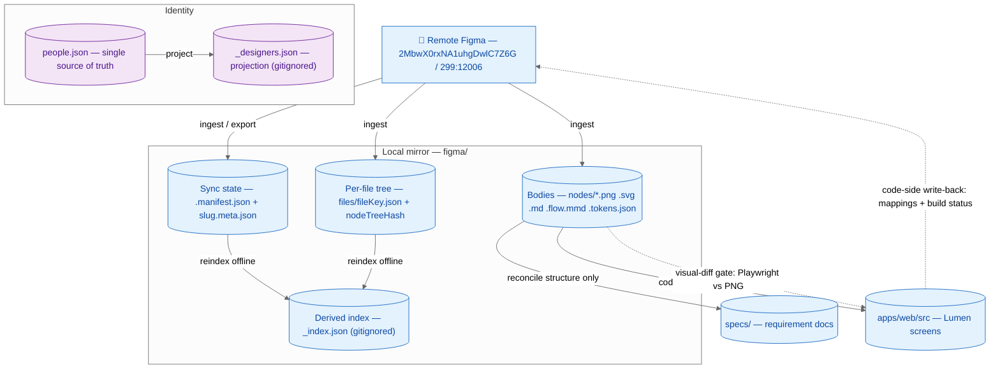

# Figma Operating Guide

> The single human reference for operating the local Figma↔Lumen integration in
> this repo. It documents the **as-built** system — every command, flag, and
> behaviour here was transcribed from the actual files under
> `.claude/commands/figma*.md`, `.claude/commands/design-*.md`,
> `.claude/agents/figma-helper.md`, `.claude/agents/design-system-analyst.md`,
> `.claude/config/figma-sync.config.yml`, `scripts/figma/`, and the state files
> under `figma/`. Where a detail is load-bearing, this guide links to the source
> file rather than duplicating its full contract. Where a command named in the
> delivery plan was **not** built as a standalone file, this guide says so
> plainly (see §3) — it documents reality, not the plan's aspiration.

**File:** Figma file `2MbwX0rxNA1uhgDwlC7Z6G` ("Future State Exploration"),
tracked root node `299:12006`. Access is via the Figma MCP (`mcp__figma__*`) —
**the session brokers auth; there are no secrets to manage or document.** The
`fileKey` is a pinned config value in `.claude/config/figma-sync.config.yml`,
never hand-typed. The MCP is called **only inside explicitly-invoked `/figma*`
commands** — never during specs, epics, implementation, `/add-*`, or CI (the
access-control policy in `.claude/CLAUDE.md`).

For the **JIRA** integration, see `docs/JIRA-OPERATING-GUIDE.md`; for
**Confluence**, see `docs/CONFLUENCE-OPERATING-GUIDE.md`. Identity/alias
mechanics and `people.json` are **shared** across all three integrations — see
§4 below. These three guides describe **one system** with three faces.

---

## 1. Overview — four state layers, three pipelines

The mirror keeps Figma design data on disk so you can query it cheaply, drive
spec/code generation from it offline, and publish selected Code Connect mappings
back — without ever editing the designer's canvas. It is organised into **four
state layers, each with exactly one owner**:

| Layer                    | On disk                                                                                  | Owner / how it's written                                                                                                                                      | Committed?                            |
| ------------------------ | ---------------------------------------------------------------------------------------- | ------------------------------------------------------------------------------------------------------------------------------------------------------------- | ------------------------------------- |
| **Sync state**           | `figma/.manifest.json` (root pointer) + per-node `figma/nodes/{slug}.meta.json` sidecars | Written by the ingest/sync path; sidecars carry `renderHash`, `structureHash`, `localEditsHash`, `version`, `lastSyncedAt`                                    | Yes                                   |
| **Per-file tree**        | `figma/files/{fileKey}.json`                                                             | Written by `/figma pull` (+ `/figma-sync`); carries the node hierarchy roster + `nodeTreeHash`                                                                | Yes                                   |
| **Derived global index** | `figma/_index.json`                                                                      | **Regenerated** by `/figma reindex` (offline) — node rollup, pipelines, frame tree, component inventory, →Lumen build coverage, `generatedAt`, `lastSyncedAt` | **No — gitignored, derived**          |
| **Identity**             | `.claude/config/people.json` (source of truth) → `figma/_designers.json` (projection)    | Humans edit `people.json`; `_designers.json` is regenerated as the Figma-bearing subset                                                                       | **No — `_designers.json` gitignored** |

The mirror **body files** — `figma/nodes/{slug}.png` / `.svg` / `.flow.mmd` /
`.md` / `.tokens.json` plus `figma/assets/{node}/…` — live under `figma/nodes/`
and `figma/assets/` and **are** committed (they are the human-readable record of
what a node looked like at last sync).

**Three ingest pipelines** classify a tracked node by design fidelity — the
current tracked root `299:12006` is **Pipeline B**:

| Pipeline | Fidelity           | Produces                                           | Downstream                                 |
| -------- | ------------------ | -------------------------------------------------- | ------------------------------------------ |
| **A**    | Flow / journey     | `.flow.mmd` (Mermaid flow) + `.md`                 | Reconcile → spec flows                     |
| **B**    | Wireframe / mid-fi | `.md` structure + `.png` render + `.meta.json`     | Reconcile → structure specs                |
| **C**    | Hi-fi              | `get_design_context` code context + `.tokens.json` | Generate → Lumen screen + visual-diff gate |

### The core rule: ingest ≠ generate ≠ reconcile ≠ codegen ≠ code-side-write-back (R3)

These are **five** distinct operations with hard boundaries. Confusing them is
the main way the mirror or the specs get corrupted, so the commands enforce the
separation:

- **Ingest** (pull from Figma → mirror) touches **only** `figma/` + the
  manifest. It never writes `specs/`. (`/figma pull`, `/figma-sync`, and
  `/add-figma-node`.)
- **Generate** (`/create-specifications`, and the planned `/figma-to-lumen`
  codegen) only **reads** the mirror; it never writes into `figma/`.
- **Reconcile** (`/reconcile-requirements`) is the **only** path from a changed
  mirror into `specs/` requirement docs. **No command ever auto-runs it** — sync
  only _suggests_ it, and only for **structure** changes (a render-only restyle
  routes to the visual-diff gate, not to reconcile).
- **Codegen** (Figma hi-fi → Lumen screen) reads the mirror and writes
  `apps/web/src/…`; it never writes `figma/` or `specs/`.
- **Code-side write-back** (Code Connect mappings + build status) is
  **human-gated, dry-run-first, and code-side only** — it publishes a mapping
  and updates `componentRef`/`buildStatus`. **The Figma canvas is never
  edited.**



---

## 2. The `figma-helper` agent

`figma-helper` (`.claude/agents/figma-helper.md`) is the **read/analyze** face
of the mirror. The `/figma "<natural language>"` router delegates every query
intent to it, and it is also runnable directly via
`claude --agent figma-helper`. It:

- Reads `figma/_index.json` (+ `figma/_designers.json`) and **drills** to
  `figma/nodes/{slug}.md` or the screenshot when a query needs detail — it never
  re-fetches from Figma to answer a query.
- **Resolves designer aliases** through `.claude/config/people.json` (via the
  `_designers.json` projection); an unresolved handle **prompts a `people.json`
  entry — never a guess** (`unresolvedAliasPolicy: "ask"`).
- **Asks a multi-choice clarifying question** (`AskUserQuestion`) when a prompt
  is vague, rather than assuming scope.
- **Honours the 24-hour staleness check** against `_index.json.lastSyncedAt`
  (see §5) and surfaces a banner + sync offer before answering from a stale
  mirror.
- **Never mutates** remote Figma and **never writes back inline.** Sync/pull
  intents are _described_ and handed back to the `/figma` router (which routes
  them to the ingest/sync commands). Codegen and Code Connect are **not**
  performed here.

Its MCP surface is deliberately tiny — `get_metadata` and `get_screenshot` only
— so a query can confirm a node still exists or grab a fresh thumbnail without
pulling the expensive `get_design_context`.

The **`design-system-analyst`** agent
(`.claude/agents/design-system-analyst.md`) is a separate read/analyze-**only**
auditor (Phase 6): it finds token drift, component-reuse gaps, glossary coverage
holes, visual-regression staleness, and handshake/a11y gaps, then **routes**
each finding to the human-gated command that owns the fix (`/figma-token-drift`,
`/figma-codeconnect`, `/figma-glossary`, `/figma-visual-regression`,
`/design-qa`, `/design-handshake`). It **names the fix and stops** — it never
mutates code, canvas, mirror, glossary, or mappings.

---

## 3. Every command — one row each

Command names in backticks; **`Yes`/`No`** (not a checkmark) in the "Mutates
remote?" column, with an em-dash naming the exact MCP call when it is `Yes`.
Pipe-in-cell alternation is escaped `\|`.

> **As-built vs. planned.** The delivery plan (Plan 02/02b) names several
> standalone commands that were **not built as their own files**. Where that is
> the case the row is marked **⚠ planned** and the "What it does" cell states
> the command that actually serves the intent today. This is the phase-7 mandate
> — document reality, note the discrepancy, invent nothing.

### init / ingest

| Command                                                  | What it does                                                                                                                                                                                                                                                                                                                                                                             | Inputs                                                                                                   | What it writes (local)                                                                                                      | Mutates remote?                                                                                |
| -------------------------------------------------------- | ---------------------------------------------------------------------------------------------------------------------------------------------------------------------------------------------------------------------------------------------------------------------------------------------------------------------------------------------------------------------------------------- | -------------------------------------------------------------------------------------------------------- | --------------------------------------------------------------------------------------------------------------------------- | ---------------------------------------------------------------------------------------------- |
| `/figma pull <node>`                                     | Ingest one node — export render + extract structure/tokens, diff hashes before overwrite, advance `lastSyncedAt`. Lives **inside** `.claude/commands/figma.md` (§4.3), not a separate file                                                                                                                                                                                               | node ref (URL / colon / hyphen id); `fileKey` defaults to config                                         | `figma/files/{fileKey}.json`, `figma/nodes/{slug}.*` bodies, `{slug}.meta.json`; **moves `lastSyncedAt`**                   | **No** (reads/exports from Figma via `get_metadata` / `get_screenshot` / `get_design_context`) |
| `/figma-init`                                            | **⚠ planned** — bootstrap a fresh mirror + seed `people.json`. **No standalone file exists.** Today the mirror is scaffolded offline (`scripts/figma/` + `/figma reindex`); a real first-pull is `/figma pull`                                                                                                                                                                           | none (reads config)                                                                                      | would scaffold `figma/` tree, `.manifest.json`, empty `_index.json`                                                         | **No**                                                                                         |
| `/add-figma-node <node>`                                 | **⚠ planned** — register a new tracked root + first pull. **No standalone file exists.** Served today by editing `figma/.manifest.json` `trackedRoots` + `/figma pull`                                                                                                                                                                                                                   | node ref                                                                                                 | `.manifest.json` `trackedRoots[]`; node bodies                                                                              | **No**                                                                                         |
| `/figma-sync [--dry-run] [--pull] [--force-pull <node>]` | Full-file drift scan — shallow `get_metadata` roster diff (per-file `nodeTreeHash` mismatch → new/moved/orphaned), per-node render/structure/localEdits classification, then re-export/re-extract only the changed nodes. **Default dry-run.** Lives in `.claude/commands/figma-sync.md`; delegates node pulls to `/figma pull` and the rollup to `/figma reindex`. Twin of `/jira-sync` | `--dry-run` (report only, default), `--pull` (apply), `--force-pull <node>` (override a `diverged` node) | changed node bodies + sidecars + per-file manifest; regenerates `_index.json`; **advances `lastSyncedAt` on `--pull` only** | **No** (reads/exports from Figma)                                                              |

### sync / index

| Command          | What it does                                                                                                                                                                                            | Inputs | What it writes (local)                                      | Mutates remote?              |
| ---------------- | ------------------------------------------------------------------------------------------------------------------------------------------------------------------------------------------------------- | ------ | ----------------------------------------------------------- | ---------------------------- |
| `/figma reindex` | **Offline** recompute of the derived index from sidecars + tree — bumps `generatedAt`, **copies `lastSyncedAt` through verbatim.** Lives inside `figma.md` (§6.1); backed by `scripts/figma/reindex.ts` | none   | `figma/_index.json` (+ regenerates `figma/_designers.json`) | **No** (never touches Figma) |

### query (all read-only, all via `figma-helper`)

| Command                       | What it does                                                                                                                                       | Inputs         | What it writes | Mutates remote? |
| ----------------------------- | -------------------------------------------------------------------------------------------------------------------------------------------------- | -------------- | -------------- | --------------- |
| `/figma "<natural language>"` | Router → `figma-helper`. Answers any read question from the mirror; describes-and-returns any sync/codegen/write-back intent to the owning command | free text      | nothing        | **No**          |
| `/figma search <query>`       | Match nodes by name/type/pipeline over `_index.json`                                                                                               | query string   | nothing        | **No**          |
| `/figma tree [node]`          | Render the frame hierarchy as a Mermaid tree (root defaults to the tracked root)                                                                   | optional node  | nothing        | **No**          |
| `/figma who <node>`           | Resolve the designer of a node via `_designers.json` → `people.json`                                                                               | node ref       | nothing        | **No**          |
| `/figma coverage`             | Show design→Lumen build coverage — which nodes are `built` / `not-built`, mapping gaps                                                             | none           | nothing        | **No**          |
| `/figma changed`              | List nodes whose `renderHash`/`structureHash` moved since last sync (change classification)                                                        | none           | nothing        | **No**          |
| `/figma uses <component>`     | Component-usage map — which nodes reference a given component                                                                                      | component name | nothing        | **No**          |

### codegen (Figma hi-fi → Lumen)

| Command                  | What it does                                                                                                                                                                                                                                                                                            | Inputs         | What it writes (local)                                | Mutates remote? |
| ------------------------ | ------------------------------------------------------------------------------------------------------------------------------------------------------------------------------------------------------------------------------------------------------------------------------------------------------- | -------------- | ----------------------------------------------------- | --------------- |
| `/figma-to-lumen <node>` | **⚠ planned / deferred** — generate a Lumen screen from a hi-fi node, then run the visual-diff gate. **No command file and no pattern doc exist** (Phase 4 codegen Part 2 was deferred). Today: no automated codegen path; hi-fi work is manual, reusing `apps/web/src/components/` per the UI protocol | hi-fi node ref | would write `apps/web/src/…`, then diff vs mirror PNG | **No**          |

### write-back (the only commands that change remote Figma)

| Command                                                                   | What it does                                                                                                                                                                                                                                                                                                                                                                                                                                           | Inputs                          | What it writes (local)                                                           | Mutates remote?                                                                                                  |
| ------------------------------------------------------------------------- | ------------------------------------------------------------------------------------------------------------------------------------------------------------------------------------------------------------------------------------------------------------------------------------------------------------------------------------------------------------------------------------------------------------------------------------------------------ | ------------------------------- | -------------------------------------------------------------------------------- | ---------------------------------------------------------------------------------------------------------------- |
| `/figma-codeconnect <node>`                                               | Author a **template-file** Code Connect mapping for one node (7-step RESOLVE→INSPECT→SCAFFOLD→DRY-RUN→APPROVE→PUBLISH→RECONCILE). Resolves the Lumen name through the glossary (**`verified` required**), dry-runs, publishes, reconciles `componentRef`/`buildStatus`, reindexes. This is the **real** write-back path — it replaces the planned `/figma-map-component` / `/figma-suggest-mappings` / `/figma-map-subtree` (none of which were built) | node ref; `fileKey` from config | scaffolds + updates sidecar (`componentRef`, `buildStatus`) + reindex on publish | **Yes** — `add_code_connect_map` / `send_code_connect_mappings` (mapping metadata only; **canvas never edited**) |
| `/figma-codeconnect-migrate`                                              | Migrate any legacy React-parser Code Connect to the framework-agnostic template mechanism (`@figma/code-connect/html`) — the React parser is retired **2026-08-17** (D20). Backed by `.claude/commands/figma-codeconnect-migrate.md`                                                                                                                                                                                                                   | none / paths                    | rewrites Code Connect template files                                             | **Yes** — republishes mappings via the Code Connect API                                                          |
| `/figma-map-component` · `/figma-suggest-mappings` · `/figma-map-subtree` | **⚠ planned — not built.** No command files exist. The write-back intent they described is served by `/figma-codeconnect` (single-node, template-file, human-gated)                                                                                                                                                                                                                                                                                    | —                               | —                                                                                | —                                                                                                                |

### glossary (Figma↔Lumen name resolver)

| Command                                       | What it does                                                                                                                   | Inputs                  | What it writes (local)                 | Mutates remote? |
| --------------------------------------------- | ------------------------------------------------------------------------------------------------------------------------------ | ----------------------- | -------------------------------------- | --------------- |
| `/figma-glossary suggest`                     | Propose Figma-component → Lumen-component mappings (`inferred`) for review; backed by a suggest script                         | none                    | proposals (not persisted until `add`)  | **No**          |
| `/figma-glossary add <figmaName> <lumenPath>` | Persist a **`verified`** mapping into `.claude/config/figma-lumen-glossary.json` — the authority a `verified` publish requires | Figma name + Lumen path | writes the glossary entry (`verified`) | **No**          |

### gate (design-side quality preconditions)

| Command                    | What it does                                                                                                                                                                     | Inputs            | What it writes (local)                       | Mutates remote? |
| -------------------------- | -------------------------------------------------------------------------------------------------------------------------------------------------------------------------------- | ----------------- | -------------------------------------------- | --------------- |
| `/design-handshake <node>` | Run the Design Handshake + accessibility-spec gate — the **hard precondition** for `buildStatus: built`. Sets `handshakeStatus ∈ not-required \| pending \| cleared \| rejected` | node ref          | handshake record + sidecar `handshakeStatus` | **No**          |
| `/design-qa <node>`        | Design-QA check (a11y + design conformance) on a built screen; backed by a command + hook + template                                                                             | node / screen ref | QA report                                    | **No**          |

### quality (mirror + drift audits)

| Command                    | What it does                                                                                                                                                                                                                    | Inputs | What it writes (local)                               | Mutates remote? |
| -------------------------- | ------------------------------------------------------------------------------------------------------------------------------------------------------------------------------------------------------------------------------- | ------ | ---------------------------------------------------- | --------------- |
| `/figma-token-drift`       | **Detection-only** token-drift audit — compares `figma/tokens/figma-tokens.json` (DTCG) against the baseline via Style Dictionary; semantic > global precedence (D21). Backed by script + SD config + hook                      | none   | drift report (no token writes)                       | **No**          |
| `/figma-visual-regression` | Visual-regression health — compares rendered Lumen against the mirror render via `renderHash` equality; flags baseline-stale entries. Backed by `scripts/figma/visual-regression.ts` + `figma/.visual-regression/manifest.json` | none   | updates `.visual-regression/manifest.json` baselines | **No**          |

---

## 4. Aliases & identity

**Source of truth: `.claude/config/people.json`** — a single, hand-owned,
committed roster shared by **all three** integrations (JIRA, Confluence, Figma).
Each person has a canonical `id`, per-tool handles (`jira` / `confluence` /
`figma`), and an `aliases: []` list. `figma/_designers.json` is a **projection**
of `people.json` filtered to people who carry a `figma` handle — it is
`.gitignore`d and regenerated on every reindex, never hand-edited.

- **Resolution:** `figma-helper` and `design-system-analyst` read `people.json`
  (via `_designers.json`) to turn a Figma handle into a display name and back. A
  designer alias (`"abbas"`, `"Q"`) resolves to the canonical `qaiser.abbas`.
- **Unresolved handle:** `unresolvedAliasPolicy: "ask"` — the agent **prompts
  you to add a `people.json` entry, never a guess.** New people are **appended
  additively** (`aliases: []`); existing entries are never rewritten, and there
  is **never** a per-tool alias file to drift out of sync.
- **Current state:** the roster has 11 people; only `qaiser.abbas` carries a
  `figma` handle, so `_designers.json` currently projects a single designer. Any
  node whose designer isn't in `people.json` yet will trigger the add-a-person
  prompt on first `who`/`coverage`.

Identity mechanics are identical across the twins — see
`docs/JIRA-OPERATING-GUIDE.md §4` and `docs/CONFLUENCE-OPERATING-GUIDE.md §7`.

---

## 5. Staleness & the timestamp invariant

`figma/_index.json` carries **two timestamps with different semantics**:

| Field          | Moves when                                                           | Meaning                                    |
| -------------- | -------------------------------------------------------------------- | ------------------------------------------ |
| `generatedAt`  | **every** `/figma reindex` (and every reindex-on-publish)            | when the derived index was last recomputed |
| `lastSyncedAt` | **only on a real remote pull** (`/figma pull`; `/figma-sync --pull`) | when the mirror last matched Figma         |

**`/figma reindex` is strictly offline and MUST NOT touch `lastSyncedAt`** — it
bumps `generatedAt` and copies `lastSyncedAt` through verbatim. An offline
recompute must never mask a stale mirror. So: **reindex ≠ sync.**

The **staleness clock** is `figma/_index.json.lastSyncedAt`. The mirror is stale
when `now − lastSyncedAt > 24h` (`stalenessHours: 24` in config). When a
mirror-derived verb runs against a stale (or `null`) mirror, the router
surfaces:

> _"The Figma mirror was last synced {when}. Results may be stale. Sync now?"_ →
> **[Sync & answer / Answer from mirror anyway / Cancel]**

**Fresh mirror — `lastSyncedAt: null`.** The current mirror was **seeded
offline** (bodies + sidecars written, then `/figma reindex`) and has **never
been pulled**, so `lastSyncedAt` is `null` — which reads as _infinitely stale_.
Don't be alarmed: that's the invariant doing its job. The first real
`/figma pull` is what sets a non-null `lastSyncedAt`.

---

## 6. Node-ID convention

One node, three textual forms — using the wrong one is the top cause of a
command failing silently (D5). All three are the **same** node `299:12006`:

| Context                                       | Form           | Example                    |
| --------------------------------------------- | -------------- | -------------------------- |
| MCP API / JSON / sidecars / manifests         | **colon**      | `299:12006`                |
| Figma `/design/` URLs (`node-id=`)            | **hyphen**     | `299-12006`                |
| Asset **path segments** under `figma/assets/` | **underscore** | `figma/assets/299_12006/…` |

**Rule of thumb:** the MCP API requires the **colon** form; a `/design/` URL you
paste uses the hyphen form; `/figma-codeconnect` normalises to colon for the
sidecar and to hyphen for the URL it writes into the Code Connect template.
Never mix them.

---

## 7. Scenarios & examples

### 7.1 "Show me the wireframe screens and who designed them."

- **Clarify** (if ambiguous): _"All tracked nodes, or just Pipeline B
  (wireframes)?"_
- **Answer:** `figma-helper` filters `_index.json.items[]` by pipeline, joins
  each `designer` to a display name via `people.json`. Today that returns one
  node — `299:12006` "Mid-fi E2E flow", Pipeline B, designed by `qaiser.abbas`.

### 7.2 "What's the frame tree of the mid-fi flow?"

```
/figma tree 299:12006
```

- `figma-helper` reads the per-file tree + `_index.json`, emits a Mermaid frame
  tree (following `@.claude/standards/mermaid-standards.md`). Read-only, no MCP
  call.

### 7.3 "Which screens still need a Lumen build?"

```
/figma coverage
```

- Returns the design→Lumen coverage table — `built` vs `not-built`, plus which
  nodes have a `verified` glossary mapping ready to publish. The tracked node is
  currently `buildStatus: not-built`, `handshakeStatus: not-required`.

### 7.4 "Did anything change in Figma since I last pulled?"

```
/figma changed
```

- Compares each node's stored `renderHash`/`structureHash` against the tree.
  **Render-only** changes route to the visual-diff gate; **structure** changes
  are the only ones that warrant `/reconcile-requirements`. (With
  `lastSyncedAt: null`, this reports "never synced" until the first pull.)

### 7.5 "Who designed node 299:12006?"

```
/figma who 299:12006
```

- Resolves `designer` → `qaiser.abbas` via the projection. An unknown designer
  would prompt a `people.json` add — never a guess.

### Walkthrough A — ingest a node (`/figma pull`)

1. **Resolve the node ref** — accept a `/design/` URL (hyphen id), a bare colon
   id, or a hyphen id; `fileKey` defaults to config (`2MbwX0rxNA1uhgDwlC7Z6G`).
2. **Cheap change-signal first** — `get_metadata` tree hash + file
   `lastModified` decide whether an expensive export/`get_design_context` is
   even needed.
3. **Drill before hi-fi** — for a large/hi-fi section, `get_metadata` → pick a
   child frame → `get_design_context` on the **child**, never on a top-level
   section node (avoids the ~930k-char token blow-up).
4. **Write bodies + sidecar** — render (`.png`/`.svg`), structure (`.md`), flow
   (`.flow.mmd`), tokens (`.tokens.json`), and `{slug}.meta.json` (hashes +
   `lastSyncedAt`). **Only `figma/` is touched** — never `specs/` (R3).
5. **Reindex** — `/figma reindex` recomputes `_index.json` + `_designers.json`
   offline.
6. **Commit the mirror diff** on its own commit; a spec reconcile (if a
   **structure** change) is a **separate** commit.

### Walkthrough B — publish a Code Connect mapping (`/figma-codeconnect`)

1. **RESOLVE** — read `.claude/config/figma-lumen-glossary.json`. An existing
   map = a re-publish; a **`verified`** entry = use it; an **`inferred`** entry
   = **STOP**, promote via `/figma-glossary add` first; **no entry** = **STOP**,
   route to `/figma-glossary suggest`/`add`. **Never publish an inferred name.**
2. **INSPECT** — read props/variants/descendant tree via
   `get_context_for_code_connect`.
3. **SCAFFOLD** — author a **template file** (`@figma/code-connect/html` — not
   the retired React parser).
4. **DRY-RUN** — show the template; **per-mapping human approval** (no batch
   "apply all").
5. **APPROVE → PUBLISH** — `add_code_connect_map` /
   `send_code_connect_mappings`. **Mapping metadata only — the canvas is never
   edited.**
6. **RECONCILE** — update the sidecar `componentRef`/`buildStatus`, then reindex
   so `/figma coverage` sees it.

> **Dev-seat caveat.** `/figma-codeconnect` (and its
> `get_context_for_code_connect` / `add_code_connect_map` calls) require the
> Figma **Dev** seat, but `.claude/config/figma-sync.config.yml` currently pins
> `seat: "view"`. Publishing Code Connect will not succeed until the seat is
> upgraded to `dev`. Query, ingest (render/structure), token-drift, and the
> handshake gate all work on the **view** seat; only Code Connect publish and
> `get_design_context`-heavy hi-fi (Pipeline C) need `dev`.

### Walkthrough C — the build gate (`/design-handshake` → build)

1. `/design-handshake <node>` runs the Design Handshake + a11y-spec gate.
2. A node cannot reach `buildStatus: built` unless `handshakeStatus` is
   `cleared` (or `not-required`). `pending`/`rejected` block the build. This is
   the hard precondition (BD5).

### The hi-fi validation fixture — a note on `hifi-fixture-login`

The delivery plan called for a **throwaway hi-fi fixture**
(`hifi-fixture-login`) to validate the Pipeline C / codegen path end-to-end.
**No such node exists in the current mirror** — the only tracked node is the
Pipeline B `299:12006`. Read this as: the hi-fi fixture was either never created
or was cleaned up after validation, **and** the codegen leg it would have
exercised (`/figma-to-lumen`) was deferred and never built (§3). Treat
hi-fi/Pipeline C as **not yet exercised** in this repo until a `dev` seat + a
real hi-fi node land.

### Recommended cadence + cost note

`/figma-sync --dry-run` → review the render/structure change report → pull
changed nodes (commit the mirror diff) → `/reconcile-requirements` **only** for
**structure** changes → visual-diff gate for hi-fi screens → `/figma coverage`
to see the build gap → optional `/figma-codeconnect` to publish a mapping. Keep
**mirror-sync** and **spec-reconcile** as separate commits (R3). The cheap
`get_metadata` change-signal keeps the expensive `get_design_context` off the
hot path.

---

## 8. Write-back safety

Everything that touches remote Figma is **code-side only, human-gated, and
dry-run-first** — and the Figma canvas is **never** edited.

### Code-side only — the region rule

Write-back publishes **Code Connect mappings + build status**, nothing else. The
design surface — the canvas, frames, layers, tokens as authored by the designer
— is **read-only** to this integration. An AI clobbering the designer's canvas
is the failure mode this rule exists to prevent (§10 of the plan): canvas edits
are **declined**.

### Dry-run first, always

`/figma-codeconnect` shows the scaffolded template and requires **per-mapping
approval** before publish. **There is no batch-wide "apply all" — each mapping
is its own gate.**

### The glossary gate — never publish an inferred name

A publish resolves the Lumen component through the glossary and **requires a
`verified` entry**. An `inferred` suggestion must be promoted
(`/figma-glossary add`) — reviewed by a human — before it can be published. This
is the idempotency-adjacent guard that keeps a wrong auto-guess from reaching
Figma.

### Template-file mechanism (the deadline)

Code Connect is authored as **template files** via `@figma/code-connect/html` —
framework-agnostic and future-proof. The `@figma/code-connect/react` parser is
**retired 2026-08-17** (D20); `/figma-codeconnect-migrate` moves any legacy
React mapping across before then.

### What write-back never does

It never edits the canvas, never writes `specs/`, never runs
`/reconcile-requirements`, and never refreshes the mirror as a side effect
(reindex-on-publish is offline and does **not** advance `lastSyncedAt`). MCP is
touched **only** inside the `/figma-codeconnect`(-migrate) command — never from
a hook or CI path (BD9).

**Rule of thumb:** if an operation would change something a designer can see in
Figma, this integration does not do it. The only thing it publishes is the
code↔design _link_.

---

## Cross-references

- Router: `.claude/commands/figma.md` (inline `pull` §4.3 + `reindex` §6.1 +
  query sub-verbs)
- Agents: `.claude/agents/figma-helper.md` (query) ·
  `.claude/agents/design-system-analyst.md` (audit)
- Write-back: `.claude/commands/figma-codeconnect.md` ·
  `figma-codeconnect-migrate.md`
- Glossary: `.claude/commands/figma-glossary.md` ·
  `.claude/config/figma-lumen-glossary.json`
- Gate / quality: `.claude/commands/design-handshake.md` · `design-qa.md` ·
  `figma-token-drift.md` · `figma-visual-regression.md`
- Patterns: `.claude/patterns/figma-code-connect-template-pattern.md`
- Scripts: `scripts/figma/` (hash · reindex · validate · visual-regression) +
  Style Dictionary config
- Config: `.claude/config/figma-sync.config.yml` · Identity:
  `.claude/config/people.json`
- Mermaid rules: `@.claude/standards/mermaid-standards.md`
- **Related (twins):** `docs/JIRA-OPERATING-GUIDE.md` ·
  `docs/CONFLUENCE-OPERATING-GUIDE.md` — the JIRA and Confluence integrations
  (shared identity/alias/mirror mechanics; all three read as one system)
