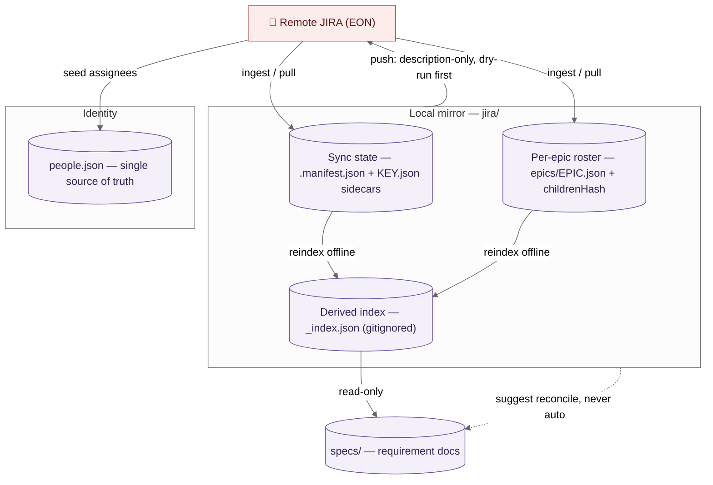

# JIRA Operating Guide

> The single human reference for operating the local JIRA integration in this
> repo. It documents the **as-built** system — every command, flag, and
> behaviour here was transcribed from the actual files under
> `.claude/commands/jira*.md`, `.claude/agents/jira-helper.md`,
> `.claude/config/jira-sync.config.yml`, and the state files under `jira/`.
> Where a detail is load-bearing, this guide links to the source file rather
> than duplicating its full contract.

**Project:** JIRA **EON** on `commbank.atlassian.net` (cloudId
`998e78d7-2a66-4fc0-809b-b43b4232d4b8`). Access is via the Atlassian MCP
(`mcp__atlassian__*`) — **the session brokers auth; there are no secrets to
manage or document.** The cloudId is a pinned config value, never hand-typed.

---

## 1. Overview — the four state layers

The mirror keeps JIRA data on disk so you can query and analyze it cheaply, edit
it locally, and push selected edits back. It is organised into **four state
layers, each with exactly one owner**:

| Layer                    | On disk                                                                           | Owner / how it's written                                                                                                              | Committed?                   |
| ------------------------ | --------------------------------------------------------------------------------- | ------------------------------------------------------------------------------------------------------------------------------------- | ---------------------------- |
| **Sync state**           | `jira/.manifest.json` (root pointer) + per-item `jira/<type>/{KEY}.json` sidecars | Written by the ingest/pull commands; sidecars carry `contentHash`, `version`, `remoteUpdatedAt`, `status_sync`                        | Yes                          |
| **Per-epic roster**      | `jira/epics/{EPIC}.json` (+ `.md`)                                                | Written by `/jira pull <EPIC>` / `/jira-sync --pull`; carries `childrenHash` (the roster fingerprint)                                 | Yes                          |
| **Derived global index** | `jira/_index.json`                                                                | **Regenerated** by `/jira reindex` (offline) — counts, `items[]`, `tree{}`, `backlog[]`, `orphans[]`, `currentSprint`, `lastSyncedAt` | **No — gitignored, derived** |
| **Identity**             | `.claude/config/people.json` (source of truth)                                    | `people.json` is regenerated by `/jira-init` from live Atlassian assignees; gitignored                                                | **No — gitignored**          |

The mirror body files themselves — `jira/<type>/{KEY}.md` — live under those
type folders (`epics/ stories/ tasks/ bugs/`; a `Dependency` issue lands in
`tasks/`).

### The core rule: ingest ≠ generate ≠ reconcile ≠ push (R3)

These are four **distinct** operations with hard boundaries. Confusing them is
the main way the mirror gets corrupted, so the commands enforce the separation:

- **Ingest** (pull from JIRA → mirror) touches **only** `jira/` + the manifest.
  It never writes `specs/`.
- **Generate** (`/create-specifications`) only **reads** the mirror; it never
  writes into `jira/`.
- **Reconcile** (`/reconcile-requirements`) is the **only** path from the mirror
  into `specs/` requirement docs. **No command ever auto-runs it** — write-backs
  only _suggest_ it.
- **Push** (write-back to JIRA) is **human-gated and dry-run-first**, and is
  **description-only**.



---

## 2. The `jira-helper` agent

`jira-helper` is the **read/analyze** subagent
(`.claude/agents/jira-helper.md`). It answers natural-language questions and
runs analyses over the local mirror. It **never mutates** remote JIRA and
**never writes back inline** to `jira/` bodies.

**What it loads:**

- `jira/_index.json` — the **primary** source: the whole project as one compact
  blob (counts, `items[]` one-liners, `tree{}`, `backlog[]`, `orphans[]`,
  `currentSprint`, `lastSyncedAt`).
- `.claude/config/people.json` — for alias resolution.
- `.claude/config/jira-sync.config.yml` — `stalenessHours`, sprint/board
  semantics, `artifactFolders`.

**When it drills into individual files:** it opens a single
`jira/<type>/{KEY}.md` **only** when full detail is required — description,
acceptance criteria, comments — e.g. for a gap analysis. It does not load the
whole mirror tree.

**Boundaries** (hard):

- No Write/Edit of `jira/` bodies, sidecars, or `_index.json`.
- No remote mutation (no create/update/transition/comment writes).
- No `specs/` writes and never triggers `/reconcile-requirements`.
- Every mutation intent it detects is **named and returned to the `/jira`
  router**, which hands off to the write-back command.

**How to run it — two ways:**

1. **Via the `/jira` router** (normal path). The router applies the staleness
   check and delegates read/analyze intents to the helper.
2. **Directly**: `claude --agent jira-helper`. It behaves identically — it
   applies the same 24h staleness check itself, and if you answer from a stale
   mirror it prepends a one-line staleness banner.

If `jira/_index.json` is missing (it's derived + gitignored), the helper tells
you to run `/jira reindex` (offline) or a real pull, then stops. If
`jira/.manifest.json` is absent, the mirror is not initialized and it tells you
to run `/jira-init`.

---

## 3. Every command — one row each

**The single most important safety takeaway: only the three write-back commands
change remote JIRA.** Everything in init/ingest that says "y" mutates only the
_local_ mirror by pulling **from** JIRA — it never writes back **to** JIRA. The
"mutates remote?" column below means _does this command write to remote JIRA?_

### init / ingest

| Command                 | What it does                                                                                                                                                                                      | Inputs                         | What it writes (local)                                                                                                       | Mutates remote?          |
| ----------------------- | ------------------------------------------------------------------------------------------------------------------------------------------------------------------------------------------------- | ------------------------------ | ---------------------------------------------------------------------------------------------------------------------------- | ------------------------ |
| `/jira-init`            | Bootstrap a fresh mirror, or (if already initialized) run a **report-only** drift diff                                                                                                            | none (reads config)            | scaffolds `jira/` tree, `.manifest.json`, empty `_index.json`; seeds `people.json` from live assignees. **No issue bodies.** | **No**                   |
| `/jira pull <EPIC>`     | Pull an epic + all its children (the read counterpart of write-back)                                                                                                                              | `<EPIC>` key                   | `jira/epics/{EPIC}.json`+`.md`, each child `.md`+`.json`; roster-diff-before-overwrite; moves `lastSyncedAt`                 | **No** (reads from JIRA) |
| `/jira-add-issue`       | Mirror one issue/epic; owns the single-item **never-clobber** write gate (Step 4). With `--with-children` on an epic, it pulls the epic **plus every child** (delegates to the `/jira pull` path) | `<key\|url> [--with-children]` | `{KEY}.md`+`.json` sidecar + manifest entry; reindex; moves `lastSyncedAt` (real pull)                                       | **No** (reads from JIRA) |
| `/jira-discover-fields` | Resolve customfield ids + `epicLinkStrategy` from live JIRA; matches by name+schema, never guesses                                                                                                | none                           | only the `fields:` and `epicLinkStrategy:` lines in `jira-sync.config.yml`                                                   | **No**                   |

### sync / index

| Command         | What it does                                                                                                                                      | Inputs                                      | What it writes (local)                                                                                                                 | Mutates remote?          |
| --------------- | ------------------------------------------------------------------------------------------------------------------------------------------------- | ------------------------------------------- | -------------------------------------------------------------------------------------------------------------------------------------- | ------------------------ |
| `/jira-sync`    | Scoped reconciliation: cheap-fields scan → per-item diff → pull only `remote-ahead`/`new` bodies; epic + roster discovery; per-orphan disposition | `[--pull] [--dry-run] [--force-pull <key>]` | **Default is dry-run (writes nothing).** On `--pull`: bodies+sidecars, per-epic manifests, orphan moves, reindex; moves `lastSyncedAt` | **No** (reads from JIRA) |
| `/jira reindex` | **Offline** rollup — rebuild `_index.json` from sidecars + epic manifests                                                                         | none                                        | `jira/_index.json` only; sets `generatedAt`; **leaves `lastSyncedAt` untouched**                                                       | **No** (no network)      |

### query (all read-only, all via `jira-helper`)

| Command                                | What it does                                                                    | Inputs           | What it writes | Mutates remote? |
| -------------------------------------- | ------------------------------------------------------------------------------- | ---------------- | -------------- | --------------- |
| `/jira "<natural language>"`           | Classify intent; answer if read-only, else hand off to write-back               | NL prompt        | nothing        | **No**          |
| `/jira search <query>`                 | Substring/field match over `_index.json.items[]`; drill into `.md` for top hits | query            | nothing        | **No**          |
| `/jira sprint [current\|next\|<name>]` | Sprint board view (`current` = `_index.json.currentSprint.name`)                | optional sprint  | nothing        | **No**          |
| `/jira backlog`                        | List `_index.json.backlog[]` + prioritization help                              | none             | nothing        | **No**          |
| `/jira who <alias>`                    | Resolve alias → handle; filter `items[]` by assignee                            | `<alias>`        | nothing        | **No**          |
| `/jira gap <KEY>`                      | Gap analysis (reads `{KEY}.md`); reports gaps + **offers** `/jira-enhance`      | `<KEY>`          | nothing        | **No**          |
| `/jira map [<KEY>]`                    | Mermaid relationship/tree graph from `_index.json.tree` + `links`               | optional `<KEY>` | nothing        | **No**          |

### write-back (the only commands that change remote JIRA)

| Command                     | What it does                                                                        | Inputs                                 | What it writes (local)                                                                                | Mutates remote?                            |
| --------------------------- | ----------------------------------------------------------------------------------- | -------------------------------------- | ----------------------------------------------------------------------------------------------------- | ------------------------------------------ |
| `/jira-push` (Feature A)    | Push a hand-edited mirror file back — **description-only**                          | `<mirror-file>` \| `--spec <artifact>` | on Apply: `{KEY}.md`+`.json` reconcile, manifest, reindex; `specs/<name>/jira-mapping.json` if traced | **Yes** — `editJiraIssue` description only |
| `/jira-create` (Feature B)  | Create a new issue from a free-text brief (ambiguity review + parent confirm first) | `"<brief>"`                            | intent record → on Apply: `{KEY}.md`+`.json` from the real returned key, manifest, reindex            | **Yes** — `createJiraIssue`                |
| `/jira-enhance` (Feature C) | Batched enhancement over tickets — decomposes each into an A-edit or B-create       | `[KEY, …]` or derived scope            | per-ticket writes as A/B; run-manifest `specs/.push-runs/<run_id>.json`; reindex                      | **Yes** — batched A + B                    |

> `/jira pull` and `/jira reindex` are **router sub-verbs** inside
> `.claude/commands/jira.md`, not standalone files. All three write-back
> commands share one 8-step pipeline defined in
> `.claude/commands/jira-write-engine.md` (not directly invokable).

---

## 4. Aliases & identity

**Source of truth: `.claude/config/people.json`** — the single identity file,
gitignored and regenerated by `/jira-init` from live Atlassian assignees. Each
person has:

```json
{
  "id": "qaiser.abbas",
  "displayName": "Qaiser Abbas",
  "aliases": ["abbas", "qa", "qaiser"],
  "jira": "abbasqa",
  "jiraAccountId": "712020:2e5bfad3-…"
}
```

- `jira` is the canonical JIRA handle that appears in `items[].assignee`.
- `aliases[]` are the informal names you type in queries (`abbas`, `qa`, …).
- The file carries `"unresolvedAliasPolicy": "ask"` — an unknown or ambiguous
  alias triggers a clarifying question, **never a guess**.
- `jira-helper` reads `people.json` directly for alias resolution — there is no
  derived projection file.

**How alias resolution works:** a query like _"abbas's tasks"_ → look up `abbas`
against every person's `aliases[]`/`displayName` in `people.json` → resolve to
`abbasqa` → filter `items[].assignee`.

**To add an alias** (e.g. map `abbas → abbasqa`): edit that person's `aliases[]`
in `.claude/config/people.json` directly. New assignees discovered on a pull are
**appended additively** to `people.json` with `aliases: []` — existing entries
are never rewritten.

**Onboarding a new team member (so `/jira who <alias>` and _"abbas's tasks"_
resolve):**

1. If they've already been assigned an issue that you've pulled, they're
   **already** in `people.json` with `aliases: []` — you only need to add the
   informal names. If they're brand new, add a full block.
2. Edit `.claude/config/people.json`:
   ```json
   {
     "id": "jane.doe",
     "displayName": "Jane Doe",
     "aliases": ["jane", "jd", "jdoe"],
     "jira": "doejane",
     "jiraAccountId": "712020:…"
   }
   ```
   - `jira` must equal the handle that appears in `items[].assignee` (check a
     pulled issue's `.json` sidecar if unsure). `jiraAccountId` is what
     write-back uses for assignee fields; leave it out only if you never intend
     to assign via write-back.
3. Verify: `/jira who jane` should now resolve to `doejane` and list their
   items.

> **Alias-collision caveat.** If a new alias you add already matches another
> person's alias or display name, resolution becomes ambiguous and the helper
> will **ask** rather than guess (`unresolvedAliasPolicy: "ask"`). Keep aliases
> unique per person.

---

## 5. Staleness & the timestamp invariant

**Staleness rule:** the mirror is stale when
`now − _index.json.lastSyncedAt > 24h` (`stalenessHours: 24` in the config), or
when `lastSyncedAt` is `null`. On every `/jira` invocation the router offers,
via a multi-choice prompt:

> _"The JIRA mirror was last synced {when}. Results may be stale. Sync now?"_ →
> **[Sync & answer / Answer from mirror anyway / Cancel]**

If you answer from the mirror anyway, the result carries a one-line staleness
banner.

**The timestamp invariant — this is the most-misunderstood part:**

- `_index.json.generatedAt` moves on **every** reindex (it just records when the
  index blob was built).
- `_index.json.lastSyncedAt` moves **only on a real remote pull** —
  `/jira-sync --pull`, `/jira pull <EPIC>`, or `/jira-add-issue`.
- **`/jira reindex` is strictly offline and MUST NOT touch `lastSyncedAt`.**
  Rebuilding the index from the sidecars you already have is _not_ a sync — no
  fresh data came from JIRA, so the "how fresh is my data?" clock does not move.
  A dry-run `/jira-sync` likewise never moves it.

So: **reindex ≠ sync.** Reindexing a 3-day-old mirror still shows it as 3 days
stale — correctly.

**Fresh mirror — `lastSyncedAt: null`.** Right after `/jira-init` (which
scaffolds but pulls **no bodies**), `_index.json.lastSyncedAt` is `null`. The
staleness rule treats `null` as _stale_ — so the very first `/jira` prompt will
offer to sync, which is correct: you genuinely have no synced data yet. The
clock only starts once you run a real pull (`/jira-sync --pull`,
`/jira pull <EPIC>`, or `/jira-add-issue`). Don't be alarmed that a
just-initialised mirror reports as stale; that's the invariant doing its job.

---

## 6. Scenarios & examples

The six read scenarios below all run through `/jira` → `jira-helper`, answered
index-native from `_index.json` (drilling into a `.md` only when full detail is
needed). Each starts with the 24h staleness check.

### 6.1 "What are the pending tasks and who they're assigned to this sprint?"

- **Clarify** (if ambiguous): _"Which sprint — current (EON Sprint 27.1.2) or
  next?"_
- **Answer:** filter `items[]` where `type=Task`, `sprint=current`,
  `statusCategory≠Done`; join each assignee to a display name via `people.json`.
  Returns a task → assignee table.

### 6.2 "What are abbas's pending tasks this sprint?"

- Resolve `abbas → abbasqa` from `people.json` (ask if it matched more than one
  person).
- Filter `items[]` by that assignee + current sprint + not-Done.

> **Sprint-rollover caveat.** `current` resolves to
> `_index.json.currentSprint.name`, which is only as fresh as your last **pull**
> (`currentSprint` is written from remote sprint state, not recomputed on an
> offline reindex). If the sprint rolled over on the JIRA board since your last
> sync, a stale mirror can answer for the _previous_ sprint. Two tells: (a) the
> staleness banner is showing, or (b) the sprint name looks wrong. Fix with
> `/jira-sync --pull` (or accept the router's "Sync & answer"), which refreshes
> `currentSprint`. Naming a sprint explicitly —
> `/jira sprint "EON Sprint 27.1.3"` — sidesteps the ambiguity entirely.

### 6.3 "Help me identify the high-priority work items."

- Filter `priority in (High, Highest)` and not Done; group by epic for
  readability.

### 6.4 "Do a gap analysis on EON-123."

- Drill into `jira/stories/EON-123.md` (full body — EON-123 is a Story, so it
  lives under `stories/`; a Task would be under `tasks/`, a Bug under `bugs/`).
  Check for a thin description, missing acceptance criteria, no testing task,
  dangling links. Report the gaps and **offer** `/jira-enhance EON-123` — the
  helper does not edit anything itself.

### 6.5 "Identify work items that can be broken down / given sub-tasks."

- Heuristics over the index: `points ≥ 8`, multi-verb summaries, no existing
  children → a candidate list you can then feed to `/jira-enhance`.

### 6.6 "Improve the descriptions of john's work items…"

- Resolve `john`, list the matching items, then **hand off to `/jira-enhance`**.
  This is a mutation — the helper names the intent and returns it; the router
  routes it. The helper never edits.

### Write-back walkthrough A — create a ticket (`/jira-create "<brief>"`)

1. **Ambiguity review** on the brief (`ambiguity-analyst`) — resolve questions
   before drafting.
2. **Parent epic** — the command ranks candidate epics from `_index.json.tree`
   and **always asks you to pick** (incl. a "none / top-level" option). It never
   auto-places a parent.
3. **Required fields** — discovered via `getJiraIssueTypeMetaWithFields`; you're
   prompted for anything not derivable from the brief.
4. A **pre-create intent record** (SHA-256 of brief+parent+nonce) is written to
   `.manifest.json` for crash-safety — a retry resumes at local-write with no
   duplicate issue.
5. **Dry-run plan** → **Apply/Skip/Edit** → create → re-pull → reconcile the
   mirror from the **real returned key** (never a fabricated key) → reindex →
   **suggest** `/reconcile-requirements` if it traces to a spec (never
   auto-run).

### Write-back walkthrough B — enhance john's tickets (`/jira-enhance <keys>`)

1. Resolve the batch; **skip Done/Closed** unless a key was explicitly named.
2. Open the run-manifest `specs/.push-runs/<run_id>.json`.
3. Per ticket: gap analysis → decompose each proposal into an **A-edit**
   (description/AC) or a **B-create** (child sub-task) → drive through the
   shared engine with a **per-ticket Apply/Reject/Edit gate**. Each decision +
   outcome is recorded in the run-manifest.
4. A remote version advance stops **that ticket only** (3-way diff shown); the
   batch continues.
5. Batch close: one `/jira reindex`, finalize the run-manifest, print **one**
   consolidated `/reconcile-requirements` suggestion + a summary table.

### Write-back walkthrough C — gap-analyze EON-123 (`/jira gap EON-123`)

This is **read-only** (query group, §3). The helper reads
`jira/stories/EON-123.md`, reports gaps, and **offers** `/jira-enhance EON-123`.
Nothing is written until you separately run the enhance command and Apply.

### Ingest scenario — resolving a conflict with `--force-pull`

`/jira-sync` never clobbers a locally-edited body silently. When the
cheap-fields scan flags an item as `remote-ahead` **and** your on-disk `.md` has
uncommitted local edits (its `localEditsHash` differs from the sidecar's
`contentHash`), the item is a **conflict** and a normal `--pull` **skips** it,
listing it under "conflicts — not pulled".

To resolve, you have two honest choices:

- **Keep your local edits → push them:** run `/jira-push <mirror-file>` first
  (description-only, dry-run gated), which advances the remote and reconciles
  the sidecar; the item is then `clean` and a later pull is a no-op.
- **Discard your local edits → take remote:** `/jira-sync --force-pull <KEY>`
  overwrites **that one file** with the remote body and resets its hashes.
  `--force-pull` is **single-key and deliberate** — it does not force the whole
  batch, and it exists precisely so discarding local work is an explicit, named
  act rather than an accident.

> **Caveat.** `--force-pull` is destructive to local edits for the named key and
> cannot be undone from the mirror. If in doubt, copy the file aside first, or
> push your edits instead of forcing.

### Ingest scenario — orphan disposition

An **orphan** is a mirrored issue whose parent epic is no longer in scope (e.g.
the epic was pulled once, the child re-parented remotely, then the epic dropped
out of your pull set). `/jira-sync` surfaces these in `_index.json.orphans[]`
and, on `--pull`, prompts **per orphan** with a disposition:

- **Re-check** — re-fetch to confirm the current parent; often the "orphan" just
  needs its epic pulled.
- **Archive** — move the body to an archive location but keep it on disk for
  reference.
- **Keep** — leave it in place as a known top-level item.

**The mirror never auto-deletes an orphan.** Disposition is always a human
choice, and "do nothing" (Keep) is a valid answer. This mirrors the write-back
philosophy: destructive moves are explicit, never implicit.

### Recommended cadence + cost note

- **Daily:** a `/jira-sync --dry-run` (or accept the router's staleness prompt)
  to see what drifted — it runs the **cheap-fields scan** (three JQL queries, no
  bodies) and is inexpensive.
- **Weekly, or when the dry-run shows changes:** `/jira-sync --pull` to bring
  bodies down. A pull fetches **full bodies only for `remote-ahead`/`new`
  items** — it never re-fetches `clean` ones, so the expensive full-body reads
  are minimised.
- **Cost model:** the cheap scan is a handful of paged JQL searches; the
  full-body `getJiraIssue` (`fields: ["*all"]`) is the costly call — the sync
  deliberately limits it to items that actually changed. `/jira reindex` is free
  (offline).

---

## 7. Write-back safety

What a mutation **will and won't** touch — read this before running any
write-back command.

### Dry-run first, always

Nothing touches JIRA before an explicit human **Apply** (Step 3 of the engine).
`/jira-sync` defaults to dry-run; the write-back commands render a dry-run plan
and gate per change (A/B) or per ticket (C). There is **no batch-wide "apply
all"** — each change is its own gate.

### The region rule — description-only pushes

Only the **pushable slice** travels to JIRA: `## Description` **plus the
in-description acceptance-criteria checklist**. Everything else — `## Status`,
`## Links`, `## Comments`, and any unknown heading — is **pull-only**
(fail-safe). Load-bearing markers `<!-- pushable -->` / `<!-- pull-only -->`
delimit the regions. If you edit a pull-only region and try to push, the command
**reports exactly which of your edits will not travel** and skips them. Status
transitions are a separate surface entirely — status stays pull-only.

### The lost-update guard — the real idempotency mechanism

**Idempotency for `/jira-push`, `/jira-create`, and `/jira-enhance` is the
dual-hash + version re-check (engine Steps 4 + 7) — NOT the `[CANS-SYNC]`
comment.** Get this right:

- **Step 4 (before any write):** re-fetch the remote `version`. If it advanced
  past the sidecar's stored version since the last sync, someone changed the
  issue — **STOP, do not mutate**, and show a 3-way diff (your local edit /
  mirror-base / current remote). You choose to pull-first or abandon. It never
  silently overwrites.
- **Step 7 (after the write):** set `contentHash = localEditsHash` and bump the
  stored `version`. A repeat of the same operation then computes an **empty diff
  → no-op** — no duplicate write.
- The `[CANS-SYNC|epic=…|version=…|run=…]` comment dropped on each applied
  change is an **audit breadcrumb in the issue timeline only**. It is _not_ the
  re-run guard — an empty pushable diff already produces no write and no
  duplicate comment.

> Hashing detail that matters:
> `localEditsHash = hashBody(mdBody(<on-disk .md>))`. The converter strips the
> H1 title via `mdBody()` **before** `hashBody()`; recompute the same way or a
> title rename reads as a false local edit. The push-diff key is
> `hashPushable(body)` over the pushable slice only.

### Terminal-state skip

`/jira-enhance` **skips Done/Closed** tickets (per the `statusCategory` map)
**unless the key was explicitly named** in the arguments. Every skipped terminal
ticket is reported.

### The run-manifest (audit / rollback)

`/jira-enhance` records every key + outcome in `specs/.push-runs/<run_id>.json`
(`{ key, kind: "A-edit"|"B-create", decision, outcome, realKey?, error? }`),
created at batch start and finalized at close. A batch is the only write-back
with rollback-worthy blast radius, so this record is mandatory.

### What write-back never does

- Never writes `specs/` requirement docs. It only writes under `jira/` and the
  supporting-state paths `specs/<name>/jira-mapping.json` and
  `specs/.push-runs/`.
- Never auto-runs `/reconcile-requirements` — it only **prints** a suggestion
  (R3).
- Never fabricates a JIRA key (`/jira-create` writes locally only from the
  `createJiraIssue` response).
- Never pushes anything but the description slice.

### Concurrency — the mirror is single-writer by design

The mirror has **no lock file**; it relies on the remote `version` re-check
(Step 4) plus the dual-hash as its safety net, not on mutual exclusion. That has
practical consequences:

- **Two people editing the same repo.** Local `.md` edits are just files under
  git — treat conflicting edits as ordinary merge conflicts. The mirror does not
  arbitrate; git does.
- **You edit locally while a teammate edits the same issue in the JIRA UI.**
  This is exactly what the Step 4 version re-check catches: at push time the
  remote `version` will have advanced past your sidecar, the write **stops**,
  and you get a 3-way diff. Nothing is silently lost.
- **Two concurrent write-backs from different machines.** Whoever applies first
  advances the remote `version`; the second one's Step 4 re-check then trips and
  stops. There is no last-write-wins race that clobbers the first edit — the
  loser is told to pull-first.
- **Interrupted write-back (crash / cancel mid-run).** `/jira-create` writes a
  **pre-create intent record** to `.manifest.json` before calling the API, so a
  retry resumes at local-write without creating a duplicate issue.
  `/jira-enhance` writes a **run-manifest** (`specs/.push-runs/<run_id>.json`)
  at batch start; a run left with un-finalized entries tells you exactly which
  tickets were applied vs. pending, so you resume rather than re-apply.

**Rule of thumb:** the version re-check makes concurrent writers _safe_ (no
silent overwrite), not _coordinated_ (no queuing). If two people are actively
churning the same issue, agree who owns it — the tooling will protect the data,
but it won't do the negotiating for you.

---

## Capabilities & roadmap

> This is the honest state of the integration. **"Supported today"** = built and
> documented in the sections above. **"Deliberately NOT supported"** = a
> considered non-goal with a reason (not a missing feature we forgot).
> **"Planned / possible"** = flagged in a plan but not yet built — no committed
> date. Every row is verifiable against the as-built system; nothing here is
> aspirational.

### Supported today

| Capability                                                                           | Where documented                                       |
| ------------------------------------------------------------------------------------ | ------------------------------------------------------ |
| Four-layer local mirror (sync state / per-epic roster / derived index / identity)    | §1 Overview — the four state layers                    |
| `jira-helper` NL query subagent over `_index.json`                                   | §2 The `jira-helper` agent                             |
| Init/ingest, sync/index, query, and write-back command families                      | §3 Every command — one row each                        |
| Alias resolution via shared `people.json`                                            | §4 Aliases & identity                                  |
| 24h staleness gate + two-timestamp invariant                                         | §5 Staleness & the timestamp invariant                 |
| Description-only, dry-run-first, lost-update-guarded write-back (walkthroughs A/B/C) | §7 Write-back safety                                   |
| Relationship-type vocabulary declared once in config (E1)                            | `.claude/config/jira-sync.config.yml` `relationships:` |

### Deliberately NOT supported (non-goals, with reasons)

| Non-goal                                        | Why                                                                                                                                                      |
| ----------------------------------------------- | -------------------------------------------------------------------------------------------------------------------------------------------------------- |
| **Link writing** (parent/blocks/relates → JIRA) | `createIssueLink` is a separate API surface; write-back is description-only. Links are **pull-only, read-for-display**. See `jira-write-engine.md` §8.6. |
| **Whole-issue write**                           | The mirror is a lossy ADF→MD projection; only the description slice round-trips safely. See §7 "The region rule" and `jira-write-engine.md` §8.6.        |
| **Status transitions in the write path**        | `transitionJiraIssue` is a separate surface; status stays pull-only. See `jira-write-engine.md` §8.6.                                                    |
| **Auto-placing a parent on create**             | Always human-confirmed — a wrong parent is expensive to move. See §3 write-back and `jira-create.md`.                                                    |
| **Auto-running `/reconcile-requirements`**      | R3 boundary (ingest ≠ generate ≠ reconcile ≠ push); write-backs only _print_ a suggestion. See §1 "The core rule" and §7 "What write-back never does".   |
| **Storing secrets / tokens**                    | The Atlassian MCP brokers auth; there is nothing for this integration to store. See §7 "What write-back never does".                                     |

### Planned / possible (not built — no committed date)

| Idea                                                                                                 | Status / where flagged                                                                                                                           |
| ---------------------------------------------------------------------------------------------------- | ------------------------------------------------------------------------------------------------------------------------------------------------ |
| Distinct rendering of `duplicates` / `clones` / custom link types in the pull-only `## Links` region | _Possible, low priority._ Currently flattened into `relates`; deferred in `01d` §0.2 because links are pull-only and the flattening is cosmetic. |
| SQLite / `.ndjson` search sidecar for `/jira search` past a few hundred issues                       | _Deferred in `01a` §3.4_ — the JSON index is sufficient at EON's current scale.                                                                  |

---

## Cross-references

- Router: `.claude/commands/jira.md` · Agent: `.claude/agents/jira-helper.md`
- Shared write-back engine: `.claude/commands/jira-write-engine.md`
- Write-back: `.claude/commands/jira-push.md` · `jira-create.md` ·
  `jira-enhance.md`
- Ingest/sync: `.claude/commands/jira-init.md` · `jira-add-issue.md` ·
  `jira-sync.md` · `jira-discover-fields.md`
- Config: `.claude/config/jira-sync.config.yml` · Identity:
  `.claude/config/people.json`
- Mermaid rules: `@.claude/standards/mermaid-standards.md`
- **Related:** `docs/CONFLUENCE-OPERATING-GUIDE.md` — Confluence integration
  (shares identity/alias/mirror mechanics)
