# Temporal Workflow Orchestration — A Developer's Guide

> A ground-up explanation of Temporal for the **Entity Onboarding** project,
> tailored to our stack: **Next.js** frontend + **NestJS** backend running on
> **ECS Fargate**.
>
> Sources: Temporal official docs + PPCC Confluence
> ([Temporal Orchestration — HPMT](https://commbank.atlassian.net/wiki/spaces/HPMT/pages/1598293149/Temporal+Orchestration),
> [ADR-003 — CT1](https://commbank.atlassian.net/wiki/spaces/CT1/pages/2155923177),
> [GS Orchestration & Workflow — SECS](https://commbank.atlassian.net/wiki/spaces/SECS/pages/1045432548)).

---

## Table of Contents

1. [Why this matters for us](#1-why-this-matters-for-us)
2. [The problem Temporal solves](#2-the-problem-temporal-solves)
3. [Core mental model](#3-core-mental-model)
4. [The building blocks](#4-the-building-blocks)
5. [How it actually works: durability & replay](#5-how-it-actually-works-durability--replay)
6. [The PPCC-specific architecture](#6-the-ppcc-specific-architecture)
7. [Coding it: the TypeScript SDK](#7-coding-it-the-typescript-sdk)
8. [Integrating with NestJS + ECS](#8-integrating-with-nestjs--ecs)
9. [Advanced patterns](#9-advanced-patterns-signals-queries-timers-child-workflows)
10. [The Entity Onboarding use case, end to end](#10-the-entity-onboarding-use-case-end-to-end)
11. [Testing](#11-testing)
12. [Operations, gotchas & rules](#12-operations-gotchas--rules)
13. [Glossary](#13-glossary)

---

## 1. Why this matters for us

The project doc (`entity-onboarding-commbiz-personas.md`) lists **Temporal
Workflow Orchestration** as an in-scope architectural pillar:

> **Temporal Workflow Orchestration** — async post-submission processing via
> Azure EventHub → Temporal Workers **GP6 — Durable Workflow Execution**:
> Temporal models long-running multi-party processes with retry and audit **ADR3
> — Workflow orchestration engine → Temporal → Decided**

Concretely, in Entity Onboarding the **POBO submits an entity onboarding
journey**, which kicks off a process that:

1. Invites Beneficial Owners (BOs) and Directors, then **waits — possibly for
   days** — for each to log in and complete their section.
2. Once everyone attests, generates a KYC PDF (DocDir), stores it (DDS), uploads
   to SharePoint, and notifies GCO.
3. Must **survive crashes, retries, and restarts** without losing progress or
   double-processing.

That "wait for days, survive restarts, retry automatically, keep an audit trail"
shape is _exactly_ what Temporal exists for. This guide explains what it is and
how you'd build it here.

At PPCC specifically, Temporal is not a one-off —
[ADR-003](https://commbank.atlassian.net/wiki/spaces/CT1/pages/2155923177)
adopts it as the **platform-wide durable workflow orchestrator**: the single
mechanism for any flow that "must survive a restart and retry."

---

## 2. The problem Temporal solves

### 2.1 The naive approach and why it breaks

Imagine you implement the post-submission flow as a normal async function in
NestJS:

```typescript
async function processOnboarding(journeyId: string) {
  await inviteParticipants(journeyId); // step 1
  await waitForAllToComplete(journeyId); // step 2 — could take DAYS
  const pdf = await generateKycPdf(journeyId); // step 3
  await uploadToSharePoint(pdf); // step 4
  await notifyGco(journeyId); // step 5
}
```

Every one of these is a landmine in a distributed system:

| What goes wrong                                       | Consequence with naive code                                          |
| ----------------------------------------------------- | -------------------------------------------------------------------- |
| ECS task is recycled during a deploy at step 3        | Entire process is **lost**. PDF never generated. Nobody knows.       |
| `generateKycPdf` throws a transient 503               | Whole flow fails; you must rebuild retry + backoff by hand           |
| Step 2 waits for days                                 | You can't hold an HTTP request or a promise open for days on Fargate |
| Task retried after partial success                    | `notifyGco` fires **twice** — no idempotency                         |
| Auditor asks "what happened to journey X on the 3rd?" | You have scattered logs, no authoritative execution history          |

You _can_ solve each individually — an outbox table, a scheduler, a state
machine, dead-letter queues, idempotency keys, correlation IDs. But you end up
**reimplementing a worse version of Temporal**. That is literally the reasoning
in [ADR-003](https://commbank.atlassian.net/wiki/spaces/CT1/pages/2155923177):

> **Bespoke durable-execution layer (outbox table + poller)** — REJECTED. Solves
> durability but not retry/backoff/timeout/escalation/visibility — would end up
> reimplementing a worse Temporal.

### 2.2 What Temporal gives you

From the PPCC HPMT page:

> Temporal Workflows are resilient. They can run — and keep running — for years,
> even if the underlying infrastructure fails. If the application itself
> crashes, Temporal will automatically recreate its pre-failure state so it can
> continue right where it left off.

> This allows developers to write code as if failures don't exist, making it
> quicker to deliver business value.

That last line is the whole point. You write **ordinary-looking sequential
code**, and the platform makes it **durable** — crash-proof, auto-retrying, and
resumable — underneath you.

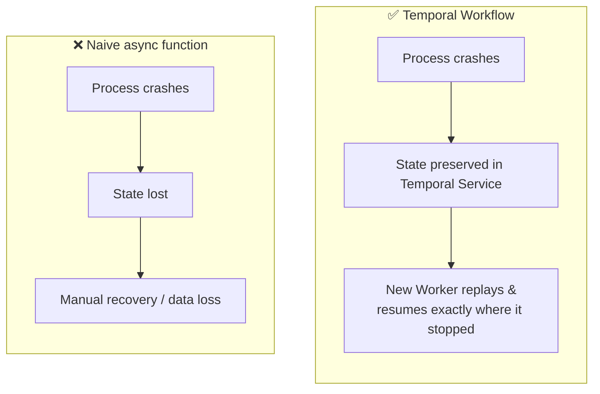

---

## 3. Core mental model

Temporal splits your code into **two kinds of functions** with very different
rules, plus a **runtime** that executes them.

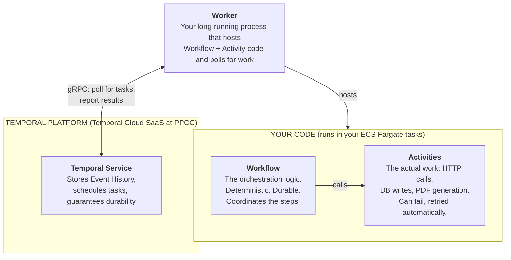

The single most important distinction:

- **Workflow code** = the _conductor_. It decides _what_ happens and _in what
  order_. It must be **deterministic** (explained in §5). It is what Temporal
  makes durable.
- **Activity code** = the _musicians_. Each one does one real-world side effect
  (call an API, write to a DB). Activities are allowed to fail; Temporal retries
  them.

> **Rule of thumb:** anything that touches the outside world (network, disk,
> randomness, current time, database) goes in an **Activity**. The **Workflow**
> only orchestrates.

---

## 4. The building blocks

### 4.1 Workflow

A **Workflow Definition** is the code; a **Workflow Execution** is one running
instance of it. Every execution has a unique **Workflow ID** (you choose it —
use a natural business key like `onboarding-{journeyId}`).

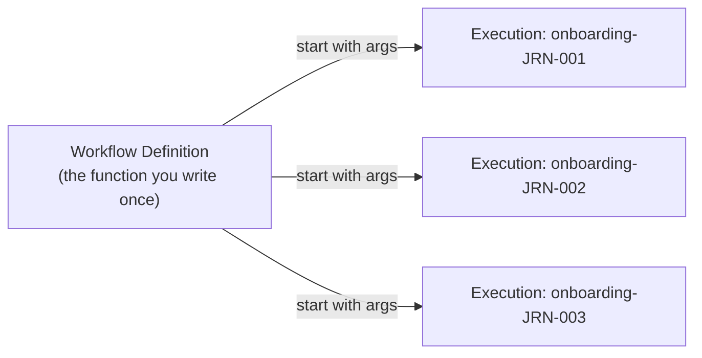

### 4.2 Activity

A unit of real work with **automatic retries** governed by a **Retry Policy**.
If `generateKycPdf` fails with a transient error, Temporal re-invokes it with
exponential backoff — you write zero retry code.

### 4.3 Worker

A process (in our case, a container running on **ECS Fargate**) that:

- Hosts your compiled Workflow and Activity code.
- **Polls** a **Task Queue** on the Temporal Service for work.
- Executes it and reports results back.

Crucially — from the HPMT page — **Temporal does not run your code**; your
infrastructure does:

> Temporal won't automatically spin up new work[ers] — it is the customer's
> infrastructure's responsibility to do so.

So Worker availability = **your ECS service's desired-count and autoscaling**.

### 4.4 Task Queue

A named queue that connects Workers to the Service. When you start a workflow
you name a Task Queue; Workers polling that queue pick up the work. It's how
routing and load-balancing happen.

### 4.5 Namespace

A logical isolation boundary inside a Temporal cluster (e.g.
`entity-onboarding-prod`). Workflows in different namespaces can't see each
other.

### 4.6 Signals, Queries, Updates

Three ways to interact with a _running_ workflow — the key to long-running,
multi-party processes:

| Mechanism  | Direction                            | Blocks?             | Use for                                             |
| ---------- | ------------------------------------ | ------------------- | --------------------------------------------------- |
| **Signal** | External → Workflow (write)          | async, no return    | "BO #2 just completed their section"                |
| **Query**  | External → Workflow (read)           | sync, returns state | "What's the current status of this journey?"        |
| **Update** | External → Workflow (write + return) | sync, validated     | "Submit attestation and tell me if it was accepted" |

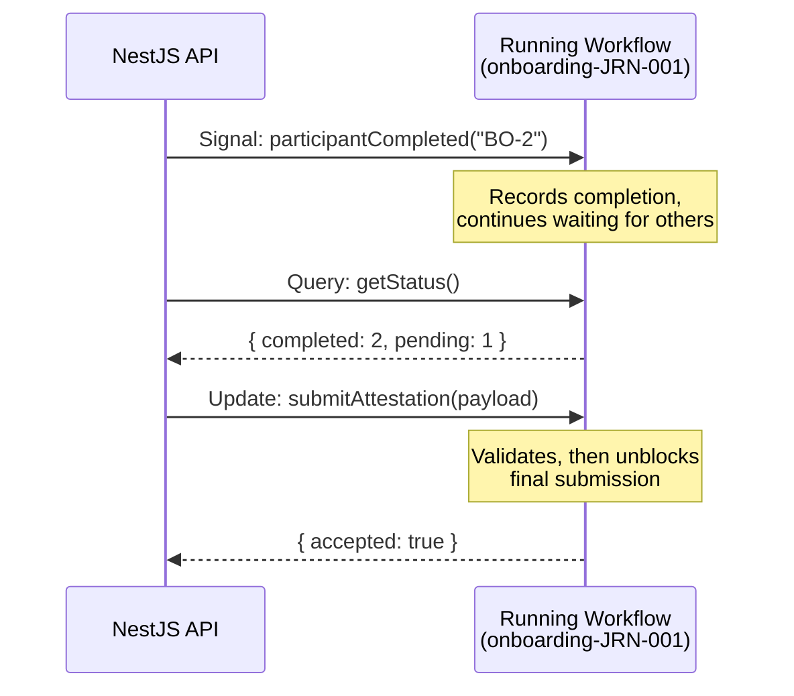

---

## 5. How it actually works: durability & replay

This is the "magic" — and understanding it explains **why the determinism rules
exist**.

### 5.1 Event History + Event Sourcing

Temporal does not snapshot your variables. Instead, every meaningful thing that
happens is appended to an **Event History** stored durably in the Temporal
Service:

```
WorkflowExecutionStarted
ActivityTaskScheduled (inviteParticipants)
ActivityTaskCompleted (inviteParticipants → {invited: 3})
TimerStarted (7-day escalation timer)
WorkflowExecutionSignaled (participantCompleted: BO-1)
...
```

### 5.2 Replay

When a Worker crashes and a new one picks up the workflow, Temporal **replays
the Event History** to reconstruct in-memory state. It re-runs your workflow
function from the top, but instead of _actually_ calling activities again, it
feeds the _recorded results_ back in. When replay reaches the point where
history ends, execution continues live.

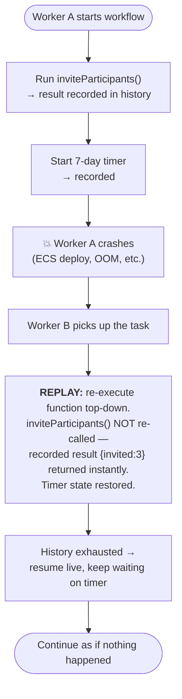

This is why the HPMT page says workers "replay the state restored from the SaaS
and continue the failed workflow."

### 5.3 Why Workflows must be deterministic

Because the workflow function is **re-executed during replay**, it must produce
the **exact same sequence of commands** every time given the same history. If it
branched differently on replay, Temporal couldn't match recorded events to code
and would fail.

**Therefore, inside Workflow code you must NOT:**

| ❌ Forbidden in Workflow code          | ✅ Do this instead                                          |
| -------------------------------------- | ----------------------------------------------------------- |
| `Date.now()`, `new Date()`             | `workflowInfo().runStartTime`, or pass time via an Activity |
| `Math.random()`, `uuid()`              | Use a deterministic seed / generate in an Activity          |
| Direct HTTP/DB/file calls              | Wrap them in an **Activity**                                |
| `setTimeout`                           | `sleep()` from `@temporalio/workflow`                       |
| Reading env vars, global mutable state | Pass as workflow args                                       |

The SDK's linter and sandbox catch most violations, but internalise the rule:
**Workflows orchestrate deterministically; Activities do the messy real-world
work.**

---

## 6. The PPCC-specific architecture

This is the part that makes Temporal usable at PPCC and differs from the vanilla
open-source picture. From the HPMT page:

- **Temporal Cloud (SaaS)** provides the managed Temporal Service (99.9% uptime,
  SOC2). PPCC does **not** self-host the cluster.
- **Workers run inside PPCC AWS workspaces** (e.g. **DHP ECS**) — _your_
  infrastructure. This is where your NestJS/TypeScript workflow + activity code
  executes.
- **The Temporal Service only manages state, never runs your workflow**, and —
  critically — it **never sees decrypted business data**.
- A **PPCC Temporal Gateway / Proxy** sits between your Workers and Temporal
  Cloud. It **encrypts all payloads with PPCC keys (via AWS KMS)** _before_
  anything leaves for the SaaS.

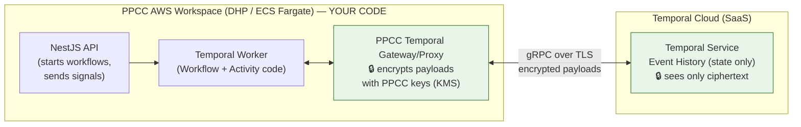

Because the SaaS only stores **encrypted** state and never needs to understand
the payload, the HPMT page records:

> Temporal is approved for orchestrating workflows involving **C&P (Customer &
> Personal) PII data and below**.

This matters for Entity Onboarding directly — you're orchestrating BO/Director
PII and KYC data, so the encryption proxy is a **hard requirement**, not
optional.

### The Codec Server

When a developer wants to _view_ an encrypted workflow's data in the Temporal
Cloud UI, a **Codec Server** (an HTTP endpoint running your decode logic)
decrypts payloads on the fly for that authorised user — so the UI shows readable
data without the SaaS ever storing plaintext.

```mermaid
sequenceDiagram
    participant Dev as Developer (Temporal Cloud UI)
    participant UI as Temporal Cloud UI
    participant Codec as PPCC Codec Server (in PPCC network)
    UI->>Codec: POST /decode (ciphertext payloads)
    Codec->>Codec: Decrypt with PPCC keys (KMS)
    Codec-->>UI: Plaintext (for this authorised session only)
    Note over UI: Dev sees readable workflow data;<br/>SaaS still only stored ciphertext
```

---

## 7. Coding it: the TypeScript SDK

Now the concrete code. Temporal's TypeScript SDK maps cleanly onto our stack. A
project typically has this layout:

```
apps/api/src/
  workflows/
    onboarding.workflow.ts     # Workflow definitions (deterministic)
    activities.ts              # Activity implementations (side effects)
    worker.ts                  # Worker entrypoint (runs as its own ECS task)
    shared.ts                  # Signal/Query/Update definitions shared by both
```

### 7.1 Activities — the real work

Activities are just async functions. They can do anything — call FenX, generate
PDFs, hit the DB.

```typescript
// apps/api/src/workflows/activities.ts
import { Documentum } from './clients/documentum';

export async function inviteParticipants(journeyId: string): Promise<string[]> {
  // real side effect: create invitations, send emails
  return ['BO-1', 'BO-2', 'DIR-1'];
}

export async function generateKycPdf(journeyId: string): Promise<string> {
  // calls DocDir, returns a document reference
  const pdfRef = await Documentum.generate(journeyId);
  return pdfRef; // e.g. "dds://doc/abc123"
}

export async function uploadToSharePoint(pdfRef: string): Promise<void> {
  /* ... */
}

export async function notifyGco(journeyId: string): Promise<void> {
  /* ... */
}
```

### 7.2 Shared definitions — signals & queries

```typescript
// apps/api/src/workflows/shared.ts
import { defineSignal, defineQuery, defineUpdate } from '@temporalio/workflow';

// A participant (BO/Director) finished their section
export const participantCompletedSignal = defineSignal<[participantId: string]>(
  'participantCompleted',
);

// POBO attests and submits — validated, returns acceptance
export const submitAttestationUpdate = defineUpdate<
  { accepted: boolean },
  [attestation: AttestationDto]
>('submitAttestation');

// UI polls current status
export const getStatusQuery = defineQuery<OnboardingStatus>('getStatus');

export interface OnboardingStatus {
  pendingParticipants: string[];
  completedParticipants: string[];
  phase: 'collecting' | 'attested' | 'documents' | 'complete';
}

export interface AttestationDto {
  signedBy: string;
  timestamp: string;
}
```

### 7.3 The Workflow — deterministic orchestration

Notice: it looks like plain sequential code, but every side effect goes through
`proxyActivities`, and it can `await` a condition that may not be satisfied for
**days**.

```typescript
// apps/api/src/workflows/onboarding.workflow.ts
import {
  proxyActivities,
  setHandler,
  condition,
  sleep,
} from '@temporalio/workflow';
import type * as activities from './activities';
import {
  participantCompletedSignal,
  submitAttestationUpdate,
  getStatusQuery,
  type OnboardingStatus,
} from './shared';

// Bind activities with a retry/timeout policy — Temporal auto-retries these.
const { inviteParticipants, generateKycPdf, uploadToSharePoint, notifyGco } =
  proxyActivities<typeof activities>({
    startToCloseTimeout: '2 minutes',
    retry: {
      initialInterval: '5s',
      backoffCoefficient: 2,
      maximumAttempts: 5, // then give up and surface the failure
    },
  });

export async function entityOnboardingWorkflow(
  journeyId: string,
): Promise<void> {
  const pending = new Set(await inviteParticipants(journeyId));
  const completed = new Set<string>();
  let attested = false;

  // React to each participant finishing (may arrive over many days)
  setHandler(participantCompletedSignal, (participantId) => {
    pending.delete(participantId);
    completed.add(participantId);
  });

  // POBO attestation — validated Update that unblocks the final phase
  setHandler(submitAttestationUpdate, (attestation) => {
    if (pending.size > 0) return { accepted: false }; // still waiting on people
    attested = true;
    return { accepted: true };
  });

  // Let the UI read live status at any time
  setHandler(
    getStatusQuery,
    (): OnboardingStatus => ({
      pendingParticipants: [...pending],
      completedParticipants: [...completed],
      phase: attested ? 'attested' : 'collecting',
    }),
  );

  // Wait — durably — until everyone completes AND POBO attests.
  // Escalate if it drags past 14 days. The Worker can crash and restart
  // repeatedly during this wait; the timer survives.
  const everyoneDone = await condition(
    () => pending.size === 0 && attested,
    '14 days',
  );
  if (!everyoneDone) {
    // timeout path — escalate / notify RM (own activity, omitted)
    return;
  }

  // Post-submission processing (each step auto-retried on transient failure)
  const pdfRef = await generateKycPdf(journeyId);
  await uploadToSharePoint(pdfRef);
  await notifyGco(journeyId);
}
```

The `condition(predicate, timeout)` call is the heart of it: the workflow
**blocks efficiently** (consuming no CPU, holding no thread) until either the
predicate becomes true — driven by incoming signals/updates — or the 14-day
timer fires. Across that entire window your ECS tasks can be redeployed a
hundred times; the workflow doesn't notice.

### 7.4 The Worker — hosting the code on ECS

This is a standalone process. You run it as its **own ECS Fargate service**
(separate from the API), so you can scale workers independently.

```typescript
// apps/api/src/workflows/worker.ts
import { NativeConnection, Worker } from '@temporalio/worker';
import * as activities from './activities';
import { getDataConverter } from './codec'; // PPCC encryption codec (see §8.3)

async function run() {
  const connection = await NativeConnection.connect({
    address: process.env.TEMPORAL_ADDRESS, // PPCC proxy / Temporal Cloud endpoint
    tls: {
      /* mTLS certs from Secrets Manager */
    },
  });

  const worker = await Worker.create({
    connection,
    namespace: process.env.TEMPORAL_NAMESPACE ?? 'entity-onboarding',
    taskQueue: 'entity-onboarding',
    workflowsPath: require.resolve('./onboarding.workflow'),
    activities,
    dataConverter: await getDataConverter(), // encrypts payloads with PPCC keys
  });

  await worker.run(); // blocks forever, polling the task queue
}

run().catch((err) => {
  console.error(err);
  process.exit(1);
});
```

### 7.5 Starting a workflow from NestJS

From an API request handler you use a **Client** to start the workflow — this
returns immediately; the workflow then runs durably in the background on the
workers.

```typescript
import { Client, Connection } from '@temporalio/client';

const connection = await Connection.connect({
  address: process.env.TEMPORAL_ADDRESS,
});
const client = new Client({
  connection,
  dataConverter: await getDataConverter(),
});

const handle = await client.workflow.start(entityOnboardingWorkflow, {
  taskQueue: 'entity-onboarding',
  workflowId: `onboarding-${journeyId}`, // natural business key = idempotent
  args: [journeyId],
});
// handle.workflowId is now durably executing; the HTTP request can return 202.
```

Using `onboarding-${journeyId}` as the Workflow ID gives you **free
idempotency**: if the POBO double-clicks submit, the second `start` with the
same ID is rejected (or you can choose a reuse policy) — you won't spawn two
onboarding processes.

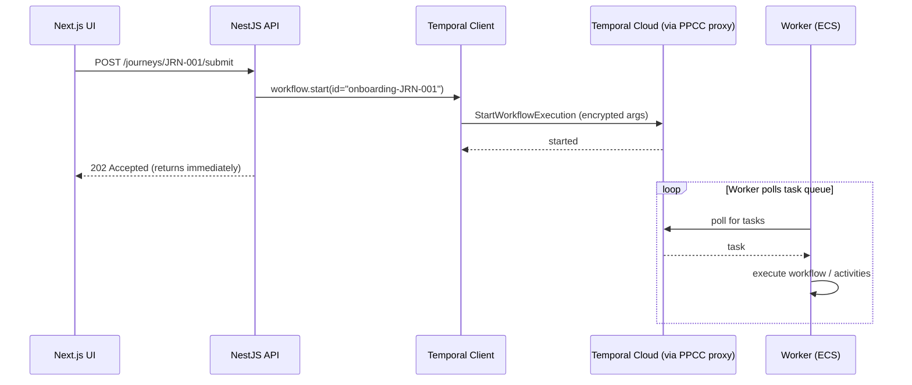

---

## 8. Integrating with NestJS + ECS

### 8.1 Two deployables, one codebase

The cleanest topology is **two ECS services** sharing your `apps/api` image but
with different entrypoints:

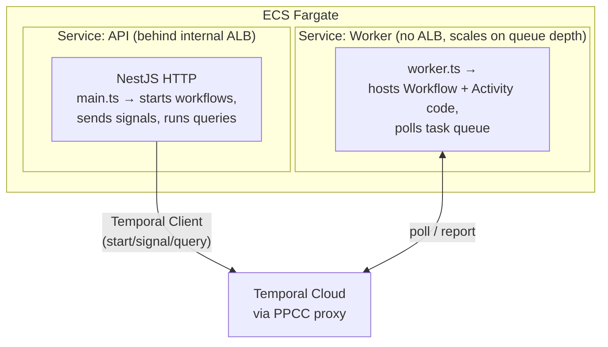

Why separate: the API scales on HTTP request volume; the Worker scales on
**task-queue backlog**. Coupling them wastes resources and couples deploy
cadence. (This mirrors ADR-003's note about a dedicated `workflows/` module +
worker entrypoint.)

### 8.2 A NestJS Temporal client provider

Wrap the client in an injectable provider with proper lifecycle — ADR-003
explicitly calls out that the Temporal client is _"the first component that
needs managed async start/stop lifecycle."_ In NestJS terms that means
`OnModuleInit` / `OnModuleDestroy`:

```typescript
// apps/api/src/temporal/temporal.service.ts
import { Injectable, OnModuleInit, OnModuleDestroy } from '@nestjs/common';
import { Client, Connection } from '@temporalio/client';
import { getDataConverter } from '../workflows/codec';

@Injectable()
export class TemporalService implements OnModuleInit, OnModuleDestroy {
  private connection!: Connection;
  client!: Client;

  async onModuleInit() {
    this.connection = await Connection.connect({
      address: process.env.TEMPORAL_ADDRESS!,
      tls: {
        /* mTLS from Secrets Manager */
      },
    });
    this.client = new Client({
      connection: this.connection,
      namespace: process.env.TEMPORAL_NAMESPACE,
      dataConverter: await getDataConverter(),
    });
  }

  async onModuleDestroy() {
    await this.connection.close();
  }
}
```

Then inject it into a service and expose thin REST endpoints the Next.js app can
call:

```typescript
@Injectable()
export class OnboardingOrchestrationService {
  constructor(private readonly temporal: TemporalService) {}

  async submitJourney(journeyId: string) {
    await this.temporal.client.workflow.start(entityOnboardingWorkflow, {
      taskQueue: 'entity-onboarding',
      workflowId: `onboarding-${journeyId}`,
      args: [journeyId],
    });
  }

  async participantCompleted(journeyId: string, participantId: string) {
    const handle = this.temporal.client.workflow.getHandle(
      `onboarding-${journeyId}`,
    );
    await handle.signal(participantCompletedSignal, participantId);
  }

  async getStatus(journeyId: string) {
    const handle = this.temporal.client.workflow.getHandle(
      `onboarding-${journeyId}`,
    );
    return handle.query(getStatusQuery);
  }
}
```

### 8.3 The encryption codec (PPCC requirement)

At PPCC you must plug in a **PayloadCodec** that encrypts before send and
decrypts on receive, using PPCC keys via KMS. The SDK wires this in through the
`dataConverter`. Both the **Client** (in the API) and the **Worker** must use
the _same_ codec, or the worker can't read what the client wrote.

```typescript
// apps/api/src/workflows/codec.ts  (skeleton — real crypto via PPCC proxy/KMS)
import {
  defaultPayloadConverter,
  type DataConverter,
} from '@temporalio/common';

export async function getDataConverter(): Promise<DataConverter> {
  return {
    payloadConverter: defaultPayloadConverter,
    payloadCodecs: [
      /* new CbaKmsEncryptionCodec() */
    ],
  };
}
```

> In the PPCC topology this encryption is often provided **by the Temporal
> Gateway/Proxy** sitting in front of Temporal Cloud rather than in your app —
> confirm with the Group Security Orchestration team (SECS page) which model
> applies to Entity Onboarding. Either way, **nothing decrypted leaves the PPCC
> network**.

### 8.4 Feeding it from the async event pipeline

Your architecture uses **Azure EventHub → Temporal Workers**. The bridge is
simple: an EventHub consumer (a small activity or a separate consumer service)
receives a post-submission event and either **starts a workflow** or **signals
an existing one**:

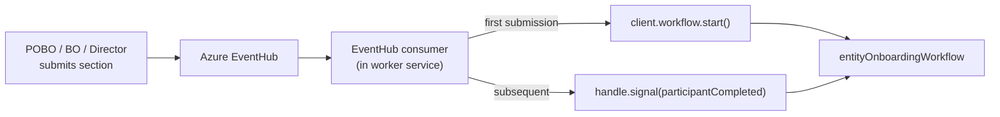

---

## 9. Advanced patterns: signals, queries, timers, child workflows

### 9.1 Durable timers & escalation

`sleep('7 days')` or `condition(pred, '14 days')` create **durable timers**
stored in Event History. Unlike `setTimeout`, they survive restarts. This is how
you implement the maker-checker/escalation flows ADR-003 mentions:

```typescript
import { sleep, condition } from '@temporalio/workflow';

// Race the completion condition against an escalation timer
const done = await condition(() => allComplete(), '7 days');
if (!done) {
  await escalateToRelationshipManager(journeyId); // an activity
}
```

### 9.2 The Update validator pattern

Updates can **reject bad input before mutating state** — from the SDK:

```typescript
import { defineUpdate, setHandler } from '@temporalio/workflow';

const submitAttestation = defineUpdate<Result, [AttestationDto]>(
  'submitAttestation',
);

setHandler(
  submitAttestation,
  (dto) => {
    /* handler runs only if validator passed */ attested = true;
    return { accepted: true };
  },
  {
    validator: (dto) => {
      if (pending.size > 0)
        throw new Error('Cannot attest: participants still pending');
    },
  },
);
```

### 9.3 Child workflows

For fan-out — e.g. one workflow per participant IDV — the parent can spawn
**child workflows** and await them:

```typescript
import { startChild } from '@temporalio/workflow';

const child = await startChild(participantIdvWorkflow, {
  args: [participantId],
});
await child.result();
```

### 9.4 Continue-As-New (bounding history)

A workflow that runs for months and receives thousands of signals grows its
Event History unboundedly. **Continue-As-New** atomically restarts the workflow
with fresh history, carrying forward only the state you pass:

```typescript
import { continueAsNew, workflowInfo } from '@temporalio/workflow';

if (workflowInfo().continueAsNewSuggested) {
  await continueAsNew<typeof entityOnboardingWorkflow>(journeyId);
}
```

### 9.5 Cancellation scopes

Long activities can be cancelled cooperatively via `CancellationScope` — e.g.
cancel an in-flight PDF generation if the POBO withdraws the journey. (See the
SDK's `cancel-fake-progress` example pattern.)

---

## 10. The Entity Onboarding use case, end to end

Putting it all together for the 9-step high-level journey from your project doc
— the durable core is **steps 7–9**:

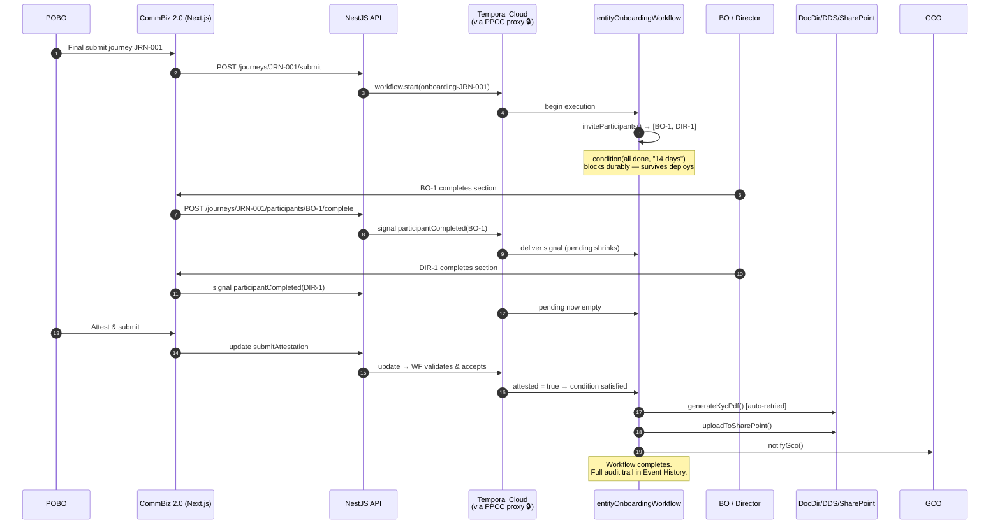

Mapping to the guiding principles/NFRs in your doc:

| Requirement (from project doc)                | How Temporal delivers it                                                 |
| --------------------------------------------- | ------------------------------------------------------------------------ |
| **GP6** Durable Workflow Execution            | Event History + replay; survives ECS restarts                            |
| **NFR7** Immutable append-only audit log      | Event History _is_ an append-only audit log per journey                  |
| **NFR4** PDF generation < 10s (async)         | `generateKycPdf` runs as an async retried Activity, off the request path |
| Multi-party, multi-day coordination           | Signals + durable `condition(..., '14 days')`                            |
| Retry on transient KYC/doc failures           | Activity Retry Policy — zero hand-written retry code                     |
| Risk #5: "Temporal workflow complexity → PoC" | This design is the shape that PoC should validate                        |

---

## 11. Testing

Temporal ships a **`TestWorkflowEnvironment`** that runs a lightweight in-memory
server with **time-skipping** — so a "14-day" timer resolves instantly in tests.

```typescript
import { TestWorkflowEnvironment } from '@temporalio/testing';
import { Worker } from '@temporalio/worker';
import { entityOnboardingWorkflow } from './onboarding.workflow';
import * as activities from './activities';

it('completes once all participants finish and POBO attests', async () => {
  const env = await TestWorkflowEnvironment.createTimeSkipping();
  try {
    const worker = await Worker.create({
      connection: env.nativeConnection,
      taskQueue: 'test',
      workflowsPath: require.resolve('./onboarding.workflow'),
      activities: {
        ...activities,
        inviteParticipants: async () => ['BO-1', 'DIR-1'],
      },
    });

    await worker.runUntil(async () => {
      const handle = await env.client.workflow.start(entityOnboardingWorkflow, {
        taskQueue: 'test',
        workflowId: 'test-JRN-001',
        args: ['JRN-001'],
      });
      await handle.signal(participantCompletedSignal, 'BO-1');
      await handle.signal(participantCompletedSignal, 'DIR-1');
      await handle.executeUpdate(submitAttestationUpdate, {
        args: [{ signedBy: 'POBO' }],
      });
      await handle.result(); // resolves without waiting real 14 days
    });
  } finally {
    await env.teardown();
  }
});
```

Test the **Activities separately** as ordinary unit tests (they're just
functions). Keep them thin so the messy mocking lives there, not in workflow
tests.

---

## 12. Operations, gotchas & rules

### Determinism rules (repeat, because it's the #1 source of bugs)

- ✅ Workflows: only orchestrate. No `Date.now()`, `Math.random()`, network, DB,
  or file I/O.
- ✅ All side effects → Activities.
- ✅ Use `sleep()` / `condition()`, never `setTimeout`.
- ✅ **Versioning:** once a workflow is live, changing its code can break replay
  of in-flight executions. Use the SDK's **patching / `patched()`** API (or
  Worker Versioning) to evolve workflows safely. Never blindly reorder activity
  calls in a deployed workflow.

### Worker & scaling

- Workers are **your** responsibility (HPMT: Temporal won't spin them up).
  Autoscale the ECS Worker service on **task-queue backlog / schedule-to-start
  latency**, not CPU alone.
- Run Worker as a **separate ECS service** from the API.
- Set sensible **Activity timeouts** (`startToCloseTimeout`) and **Retry
  Policies** (`maximumAttempts`) so poison messages don't retry forever.

### Security (PPCC-specific, non-negotiable)

- All payloads **encrypted with PPCC keys before leaving for Temporal Cloud**
  (proxy/codec). Approved for **C&P PII and below**.
- Use the **Codec Server** to view data in the Temporal UI without the SaaS ever
  seeing plaintext.
- Onboard via the **Group Security Orchestration** front door (SECS page) — they
  own the PPCC Temporal tenant, gateway, SSO, and Observe/Obstack integration.

### Observability

- PPCC's platform integrates Temporal metrics with **Observe/Obstack** out of
  the box.
- Each Workflow Execution's **Event History** is your primary debugging + audit
  artifact — searchable in the Temporal Cloud UI.

### When NOT to use Temporal (per ADR-003)

Don't reach for it for _everything_. ADR-003 keeps the plain synchronous event
bus for **same-process, best-effort** notifications (e.g. UI toasts) where
losing an event on crash is acceptable. Use Temporal when **a lost or duplicated
step would corrupt state or silently drop data** — money movement, GL posting,
consumed-but-unprocessed integration data, and our KYC onboarding flow.

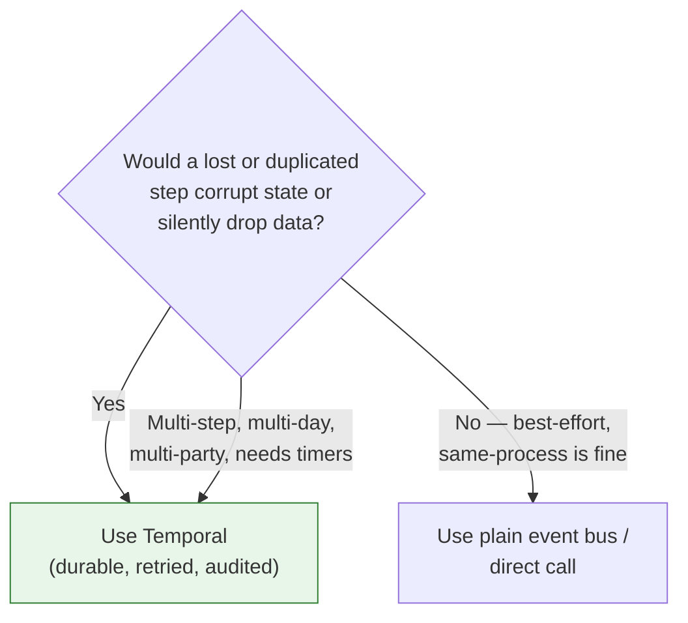

---

## 13. Glossary

| Term                         | Meaning                                                                                                                          |
| ---------------------------- | -------------------------------------------------------------------------------------------------------------------------------- |
| **Workflow**                 | Deterministic orchestration code; a sequence of steps to achieve a business outcome. One _Definition_, many _Executions_.        |
| **Activity**                 | A single unit of real-world work (I/O, side effects) with automatic retries.                                                     |
| **Worker**                   | Your process (ECS Fargate task) that hosts Workflow + Activity code and polls a Task Queue. **You** run and scale it.            |
| **Task Queue**               | Named queue routing work from the Service to Workers.                                                                            |
| **Namespace**                | Logical isolation boundary within a Temporal cluster.                                                                            |
| **Event History**            | Durable, append-only log of everything that happened in an execution; the basis for replay and the audit trail.                  |
| **Replay**                   | Re-executing workflow code against recorded history to rebuild state after a crash.                                              |
| **Determinism**              | The requirement that workflow code produce identical commands on replay.                                                         |
| **Signal**                   | Async, one-way message _into_ a running workflow (write, no return).                                                             |
| **Query**                    | Synchronous _read_ of a running workflow's state (no mutation).                                                                  |
| **Update**                   | Synchronous, validated call into a workflow that mutates and returns a result.                                                   |
| **Timer**                    | Durable `sleep`/`condition` timeout that survives restarts.                                                                      |
| **Child Workflow**           | A workflow started and coordinated by a parent workflow.                                                                         |
| **Continue-As-New**          | Atomically restart a workflow with fresh history to bound its size.                                                              |
| **Retry Policy**             | Config controlling how failed Activities are retried (interval, backoff, max attempts).                                          |
| **Temporal Cloud / Service** | The managed SaaS that stores state and schedules tasks (99.9% uptime, SOC2). Never runs your code; at PPCC sees only ciphertext. |
| **Temporal Gateway / Proxy** | PPCC-hosted proxy that encrypts payloads with PPCC keys (KMS) before they reach Temporal Cloud.                                  |
| **Codec Server**             | HTTP server that decrypts payloads on demand so authorised users can read data in the Temporal UI.                               |
| **gRPC**                     | The HTTP/2 + protobuf transport the SDK uses to talk to the Temporal Service.                                                    |
| **SDK**                      | Temporal client library; we use the **TypeScript SDK** (`@temporalio/*`).                                                        |

---

## Further reading

- **Temporal official docs** — <https://docs.temporal.io>
- **PPCC — Temporal Orchestration (HPMT)** —
  <https://commbank.atlassian.net/wiki/spaces/HPMT/pages/1598293149/Temporal+Orchestration>
- **PPCC — ADR-003 Workflow Orchestration (CT1)** —
  <https://commbank.atlassian.net/wiki/spaces/CT1/pages/2155923177>
- **PPCC — GS Orchestration & Workflow Solution using Temporal (SECS)** —
  <https://commbank.atlassian.net/wiki/spaces/SECS/pages/1045432548>
- **PPCC — Group Security Orchestration getting started** —
  <https://groupsecurity.pages.commbank.io/tenant/orchestration/getting-started/>

> **Next step for our project:** Risk #5 in the project doc flags a **Temporal
> PoC as an FY27 build pre-condition**. The design in §7–§10 is exactly what
> that PoC should stand up: one workflow, a handful of activities, signals from
> the EventHub bridge, an ECS Worker service, and the PPCC encryption codec —
> proving the durable multi-party onboarding flow end to end.
